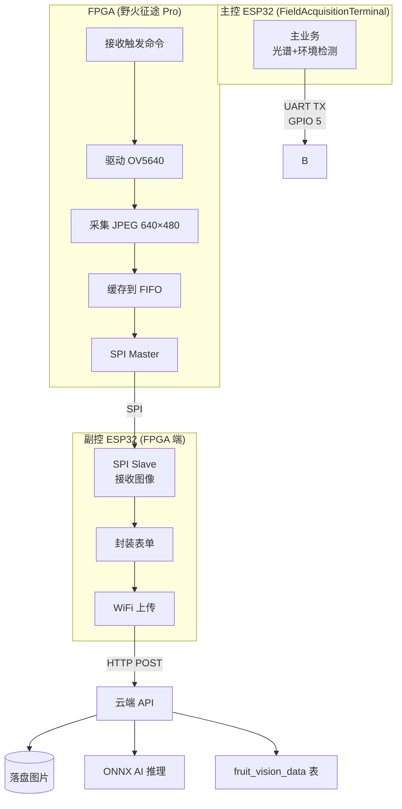
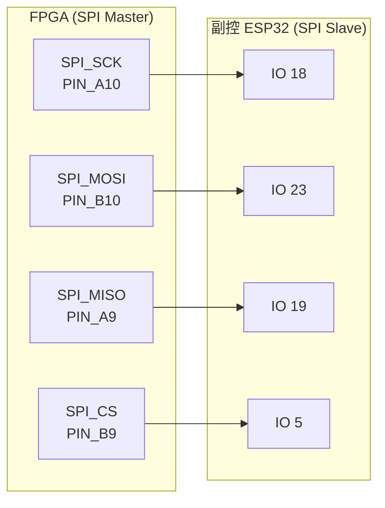
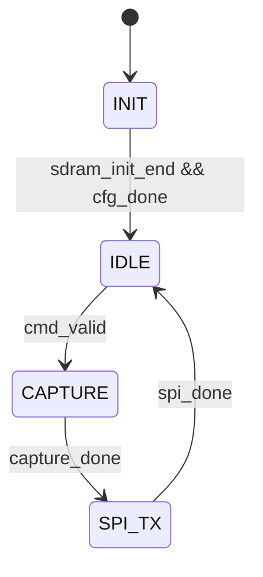

# FPGA 图像采集模块开发文档

> **版本**: v3.0
> **更新时间**: 2026-05-06
> **核心变化**：根据实际代码 `image_capture_top.v` 全面修正：
>
> - 顶层模块名称：`image_capture_system` → `image_capture_top`
> - 状态机：9状态简化为4状态 (INIT/IDLE/CAPTURE/SPI_TX)
> - 存储方案：使用 **SDRAM (W9825G6KH-6)** 而非内部Block RAM
> - JPEG捕获：基于 `vsync` 信号检测帧边界
> - 寄存器配置：256个 (含JPEG引擎开启)

---

## 1. 系统架构总览

本模块为**多模态 AI 视觉扩展模块**的边缘采集单元，实现樱桃品质的视觉检测功能。

**角色分工：**

- **主控 ESP32 (FieldAcquisitionTerminal)**：运行主业务（光谱+环境检测），通过 UART 发送触发命令。
- **FPGA (野火征途 Pro EP4CE10F17C8N)**：接收主控触发命令后，驱动 OV5640 摄像头采集 JPEG 图像，缓存到内部 FIFO，通过 SPI 发送图像数据。
- **副控 ESP32 (FPGA 端)**：通过 SPI 从 FPGA 接收图像数据，通过 WiFi 上传至云端。

**目标器件：** Altera Cyclone IV EP4CE10F17C8N

**数据流向：**




**云端处理流程：**

```
OV5640 原始 640×480 JPEG → stb_image 解码 → Center Crop 480×480 → Resize 224×224 → ConvNeXt-Tiny ONNX 推理 → quality_level (1~10)
```

---

## 2. 硬件接口与引脚分配

### 2.1 主控 ESP32 与 FPGA 的 UART 通信

> **重要**：主控 ESP32 仅使用 **GPIO 5** 作为 UART TX 向 FPGA 发送触发命令，无需 RX。


| 属性          | 值       |
| ----------- | ------- |
| 信号          | UART_TX |
| 主控 ESP32 引脚 | GPIO 5  |
| FPGA 引脚     | PIN_N6  |
| 波特率         | 9600bps |
| 格式          | `CAM    |


### 2.2 FPGA 与副控 ESP32 的 SPI 通信




| FPGA 信号  | 描述   | 副控 ESP32 | 备注                      |
| -------- | ---- | -------- | ----------------------- |
| SPI_SCK  | 时钟线  | GPIO 4     | FPGA内部时钟分频，默认5分频        |
| SPI_MOSI | 主出从入 | GPIO 5     | FPGA 传图给 ESP32 的数据线     |
| SPI_MISO | 主入从出 | GPIO 6     | 预留（当前未使用）               |
| SPI_CS   | 片选信号 | GPIO 7     | 低电平有效，ESP32 检测片选下降沿开始接收 |


### 2.3 其他外设引脚


| 外设   | 引脚      | 功能           |
| ---- | ------- | ------------ |
| BEEP | PIN_J11 | 蜂鸣器 PWM 输出   |
| DS   | PIN_R1  | 74HC595 串行数据 |
| SHCP | PIN_B1  | 74HC595 移位时钟 |
| STCP | PIN_K9  | 74HC595 锁存时钟 |
| OE   | PIN_L11 | 74HC595 输出使能 |


---

## 3. 通信协议

### 3.1 UART 触发协议（主控 → FPGA）

主控在用户点击"MEASURE"或 5 分钟定时任务到达时，通过 UART 下发**通行证包**，FPGA 收到后开始采集图像。

**数据包格式（ASCII 明文，以 `\n` 结尾）：**

```
CAM|<Device_ID>|<Token>|<Timestamp>\n
```

**示例：**

```
CAM|1001-01-01|device-token-001|1712800000\n
```


| 字段          | 说明                      |
| ----------- | ----------------------- |
| `CAM`       | 固定指令头，标识摄像头采集任务         |
| `Device_ID` | 设备编号（与传感器数据共用同一 ID）     |
| `Token`     | 动态下发的鉴权令牌               |
| `Timestamp` | 采集时间戳（Unix 秒级，用于云端数据对齐） |


**FPGA 解析流程：**

1. UART 接收模块（`uart_rx.v`）检测下降沿开始接收，9600波特率
2. 命令解析模块（`uart_cmd_parser.v`）检测 `CAM|` 帧头
3. 提取并存储 `device_id`、`token`、`timestamp`
4. 解析成功后 `cmd_valid` 拉高一个时钟周期
5. 蜂鸣器响起 2 秒，数码管显示北京时间

### 3.2 SPI 数据链路协议（FPGA → 副控 ESP32）

FPGA 通过 SPI 向 ESP32 发送一个完整的数据包，包含认证信息和图像数据。

**数据包格式：**

```
┌──────────┬──────────┬────────────────────────────┬────────────────┬────────────────┬────────────────────────────┬──────────┐
│   帧头    │ Device_ID │          Token            │   Timestamp    │   JPEG Size    │        JPEG Data           │  帧尾     │
│ 0x55 0xAA│  32字节   │          32字节            │    4字节       │    4字节       │         可变长度            │ 0xCC 0x33 │
└──────────┴──────────┴────────────────────────────┴────────────────┴────────────────┴────────────────────────────┴──────────┘
```

**详细结构：**


| 字段        | 长度    | 说明                                |
| --------- | ----- | --------------------------------- |
| 帧头        | 2 字节  | 固定 `0x55 0xAA`                    |
| Device_ID | 32 字节 | 设备编号（ASCII 字符串，不足32字节补空格0x20）     |
| Token     | 32 字节 | 鉴权令牌（ASCII 字符串，不足32字节补空格0x20）     |
| Timestamp | 4 字节  | Unix 时间戳（uint32_t 大端序 Big-endian） |
| JPEG Size | 4 字节  | JPEG 数据长度（uint32_t 大端序）           |
| JPEG Data | 可变    | JPEG 图像数据（通常 20KB - 50KB）         |
| 帧尾        | 2 字节  | 固定 `0xCC 0x33`                    |


**协议总长度**：`78字节固定头 + JPEG_Data长度`

> **注意**：78字节 = 帧头2 + Device_ID 32 + Token 32 + Timestamp 4 + JPEG_Size 4

**SPI Master 状态机（`spi_master_tx.v`）：**

```
状态0(IDLE) → 状态1(SEND_HEADER) → 状态2(SEND_DEVICE_ID)
    → 状态3(SEND_TOKEN) → 状态4(SEND_TIMESTAMP)
    → 状态5(SEND_JPEG_SIZE) → 状态6(SEND_JPEG)
    → 状态7(SEND_TRAILER) → 状态0(IDLE)
```

**SPI 片选握手时序：**

1. FPGA 完成 JPEG 采集后，进入 SYS_SPI_TX 状态
2. SPI Master 拉低 `spi_cs_n`（低有效）
3. ESP32 检测到片选下降沿，开始接收 SPI 数据
4. SPI 传输完成后，`spi_cs_n` 拉高

### 3.3 HTTP 上传协议（副控 ESP32 → 云端）

副控 ESP32 接收 FPGA 的 SPI 数据包后，解析出认证信息和图像数据，通过 HTTP POST 上传至云端。

> **重要**：HTTP 上传使用 `**application/octet-stream`** 格式，认证信息通过自定义 HTTP 请求头传递（**不是 multipart/form-data**）。

**HTTP 请求格式**：

```http
POST /api/device/vision HTTP/1.1
Host: 47.107.41.102:9000
X-Device-ID: <Device_ID>
X-Device-Token: <Token>
X-Timestamp: <Timestamp>
Content-Type: application/octet-stream
Content-Length: <JPEG_Size>

<JPEG 二进制数据>
```

**请求头详细说明**：


| 请求头字段            | 来源                               | 说明                         |
| ---------------- | -------------------------------- | -------------------------- |
| `X-Device-ID`    | SPI 包 Device_ID (32字节ASCII)      | 设备唯一标识                     |
| `X-Device-Token` | SPI 包 Token (32字节ASCII)          | 设备认证令牌                     |
| `X-Timestamp`    | SPI 包 Timestamp (uint32_t转ASCII) | Unix时间戳                    |
| `Content-Type`   | 固定值                              | `application/octet-stream` |
| `Content-Length` | SPI 包 JPEG_Size                  | JPEG图像大小                   |


**数据来源对应关系**：


| SPI 协议字段         | HTTP 请求头         | 说明                |
| ---------------- | ---------------- | ----------------- |
| 帧头后第1字段 (32字节)   | `X-Device-ID`    | 直接映射              |
| 帧头后第2字段 (32字节)   | `X-Device-Token` | 直接映射              |
| 帧头后第3字段 (4字节大端序) | `X-Timestamp`    | uint32_t转ASCII字符串 |
| 帧头后第4字段 (4字节大端序) | `Content-Length` | JPEG数据长度          |


**上传路径**：`POST http://47.107.41.102:9000/api/device/vision`

---

## 4. FPGA 端开发指南（Verilog）

### 4.1 顶层模块架构（`image_capture_top.v`）

FPGA 的核心任务：**"接收触发、配置摄像头、采集 JPEG、SDRAM 缓存、SPI 发送"**。

**子系统组成：**


| 子系统       | 模块                    | 说明                              |
| --------- | --------------------- | ------------------------------- |
| 时钟管理      | `clk_gen`             | 产生 100MHz、100MHz_shift、25MHz 时钟 |
| UART 命令解析 | `uart_cmd_parser`     | 接收 `CAM                         |
| 摄像头驱动     | `ov5640_jpeg_capture` | 包含 OV5640 配置、JPEG捕获、SDRAM存储     |
| SPI 发送    | `spi_master_tx`       | 向 ESP32 发送图像数据                  |
| 蜂鸣器       | `buzzer_pwm_ctrl`     | 采集提示音                           |
| 数码管显示     | `rtc_display_74hc595` | 显示北京时间                          |


**系统状态机（4个状态）：**

```verilog
localparam SYS_INIT     = 3'd0;   // 初始化，等待SDRAM和摄像头配置完成
localparam SYS_IDLE     = 3'd1;   // 空闲，等待 UART 触发命令
localparam SYS_CAPTURE  = 3'd2;   // 采集 JPEG 帧
localparam SYS_SPI_TX   = 3'd3;   // SPI 发送图像数据
```

**流程图：**




### 4.2 UART 命令解析（`uart_rx.v` + `uart_cmd_parser.v`）

**UART 接收特性：**

- 波特率：9600bps
- 数据位：8位
- 停止位：1位
- 黄金采样点：在每位中间采样，抗干扰
- 亚稳态消除：3级寄存器同步

**命令解析特性：**

- 智能超时：10ms 超时自动完成时间戳解析
- 完美边界处理：支持变长ASCII字段，以 `|` 分隔符定位边界
- 实时移位累加：边收边算时间戳

**输出信号：**

```verilog
output reg         cmd_valid    // 解析成功，脉宽1周期
output reg  [255:0] device_id    // 设备ID（32字节ASCII，256位）
output reg  [255:0] token        // 令牌（32字节ASCII，256位）
output reg  [31:0] timestamp     // Unix时间戳（uint32_t）
output reg         cmd_error     // 解析错误
```

### 4.3 OV5640 摄像头驱动

**通信接口：** SCCB（兼容 I2C）

**寄存器配置（`ov5640_cfg.v`）：**

- 总计 **256 个**寄存器配置
- 写入时钟：250kHz
- 器件地址：0x3C (SLAVE_ADDR = 7'h3C)

**分辨率：** VGA 640×480

**JPEG 帧捕获（`ov5640_jpeg_capture.v`）：**

- 摄像头配置完成后 `cfg_done` 拉高
- `capture_req` 上升沿触发采集（`cmd_valid` 触发）
- 检测 `vsync` 信号上升沿表示新帧开始
- JPEG 数据写入 SDRAM（FIFO 深度 512）
- `capture_done` 在 `vsync` 信号到来时拉高，表示一帧采集完成

### 4.4 SDRAM 存储

> **重要**：当前版本使用外部 **SDRAM (W9825G6KH-6)** 存储 JPEG 图像数据。

**SDRAM 规格：**

- 型号：W9825G6KH-6
- 容量：32MB (16位数据总线)
- 突发长度：512
- 地址空间：0x000000 ~ 0x1FFFFF

**SDRAM 子系统 (`sdram_top.v`)：**

- `wr_fifo_wr_clk`：使用 OV5640 像素时钟 (ov5640_pclk)
- `wr_fifo_wr_data`：JPEG 原始数据
- `rd_fifo_rd_clk`：系统时钟 (sys_clk)
- `rd_fifo_rd_data`：16位数据输出给 SPI 模块
- `capture_req` 作为复位信号，清空 FIFO 和地址

**FIFO 控制：**

- 写 FIFO：与 OV5640 像素时钟同步
- 读 FIFO：与系统时钟同步
- 乒乓模式：禁用 (pingpang_en = 1'b0)

### 4.5 SPI Master 发送（`spi_master_tx.v`）

**时钟分频：** 5 分频（50MHz / 5 = 10MHz）

**传输顺序：**

1. **帧头（2字节）：** 0x55, 0xAA
2. **Device_ID（32字节）：** 从顶层模块传入，ASCII 格式
3. **Token（32字节）：** 从顶层模块传入，ASCII 格式
4. **Timestamp（4字节）：** 从顶层模块传入，uint32_t 大端序
5. **JPEG Size（4字节）：** 大端序
6. **JPEG Data（可变）：** 从 SDRAM 读出，每次读取16位（2字节）
7. **帧尾（2字节）：** 0xCC, 0x33

**关键信号：**

```verilog
input  send_enable        // 发送使能（sys_state == SYS_SPI_TX）
input  [255:0] device_id  // 设备ID（256位 = 32字节）
input  [255:0] token      // 令牌（256位 = 32字节）
input  [31:0]  timestamp  // Unix时间戳
input  [31:0]  jpeg_size  // JPEG大小
input  [15:0]  jpeg_fifo_rd_data  // SDRAM读取数据（16位）
output jpeg_fifo_rd_en    // FIFO 读使能
output reg spi_clk        // SPI 时钟
output reg spi_mosi       // SPI 数据
output reg spi_cs_n       // 片选（低有效）
output reg send_done      // 发送完成标志
```

**状态机（8状态）：**

```verilog
state 0: IDLE (等待 send_enable)
state 1: 发送帧头 (2字节)
state 2: 发送 Device_ID (32字节)
state 3: 发送 Token (32字节)
state 4: 发送 Timestamp (4字节)
state 5: 发送 JPEG Size (4字节)
state 6: 发送 JPEG Data (可变长度)
state 7: 发送帧尾 (2字节)
```

---

## 5. 副控 ESP32 端开发指南

### 5.1 UART 监听任务

使用 FreeRTOS 创建一个低优先级任务，持续监听 UART 缓冲区。当检测到 `CAM|` 前缀时，解析出 `device_id`、`token`、`timestamp`，存入全局结构体（供后续上传使用）。

```cpp
// 凭证结构体
struct VisionAuth {
    char device_id[32];   // 设备ID（32字节ASCII）
    char token[32];        // 鉴权令牌（32字节ASCII）
    uint32_t timestamp;    // Unix时间戳
    bool valid;
} auth = {0};
```

### 5.2 SPI Slave 与 DMA 接收

> **关键**：SPI 数据包总长度 = 帧头2 + Device_ID 32 + Token 32 + Timestamp 4 + JPEG_Size 4 + JPEG_SIZE + 帧尾2 = **78 + JPEG_SIZE 字节**

**固定字段长度**：2 + 32 + 32 + 4 + 4 + 2 = 78 字节
**完整数据包长度**：78 + JPEG_SIZE 字节

**缓冲区分配建议**：

- 最小缓冲区：78 + 20*1024 = 约 21KB
- 推荐缓冲区：100KB+（使用 PSRAM）

**接收流程**：

1. 等待 `spi_cs_n` 引脚（IO 5）下降沿
2. 片选拉低，开始 SPI 接收
3. 接收并验证帧头 `0x55 0xAA`
4. 接收 Device_ID（32字节ASCII）
5. 接收 Token（32字节ASCII）
6. 接收 Timestamp（4字节，uint32_t 大端序）
7. 接收 JPEG Size（4字节，uint32_t 大端序）
8. 根据 JPEG Size 分配缓冲区，DMA 接收 JPEG 数据
9. 接收并验证帧尾 `0xCC 0x33`
10. 片选拉高，封装 HTTP 请求并上传

### 5.3 Wi-Fi 与 HTTP 上传

副控 ESP32 解析完 SPI 数据包后，将认证信息和图像数据通过 HTTP POST 上传至云端。

> **重要**：HTTP 上传使用 `**application/octet-stream`** 格式，认证信息通过自定义 HTTP 请求头传递。

**HTTP 请求格式**：

```http
POST /api/device/vision HTTP/1.1
Host: 47.107.41.102:9000
X-Device-ID: <Device_ID>
X-Device-Token: <Token>
X-Timestamp: <Timestamp>
Content-Type: application/octet-stream
Content-Length: <JPEG_Size>

<JPEG 二进制数据>
```

**请求头映射**：


| 请求头字段            | 数据来源                            |
| ---------------- | ------------------------------- |
| `X-Device-ID`    | SPI 包 Device_ID（32字节ASCII）      |
| `X-Device-Token` | SPI 包 Token（32字节ASCII）          |
| `X-Timestamp`    | SPI 包 Timestamp（uint32_t转ASCII） |
| `Content-Type`   | 固定 `application/octet-stream`   |
| `Content-Length` | SPI 包 JPEG_Size                 |


---

## 6. 扩展功能模块

### 6.1 蜂鸣器模块（`buzzer_pwm_ctrl.v`）

**规格：**

- 频率：3kHz PWM
- 持续时间：2 秒
- 触发条件：`cmd_start` 信号上升沿（UART 接收到 `CAM|` 帧头）

**注意**：`cmd_start` 在检测到 `CAM|` 帧头时产生，而 `cmd_valid` 在完整解析完成后产生。蜂鸣器使用 `cmd_start` 触发，确保用户点击后立即响应。

**应用场景：** 采集开始/完成提示

### 6.2 数码管显示模块（`rtc_display_74hc595.v`）

**硬件：** 6 位七段数码管 + 74HC595 移位寄存器

**功能：**

- 将 Unix 时间戳转换为北京时间（UTC+8）
- 显示格式：HH.MM.SS（带小数点分隔）
- 刷新频率：1kHz 扫描

**关键特性：**

- 使用迭代减法替代除法运算（节省资源）
- 共阳极数码管驱动

### 6.3 HDMI 显示（可选，未激活）

当前版本 HDMI 输出已禁用（`tmds_`* 信号固定为 0）。

---

## 7. 开发注意事项

1. **SPI 时钟频率**：当前设置为 10MHz（5分频），可根据 ESP32 DMA 能力调整
2. **JPEG 帧完整性**：通过 `vsync` 信号检测帧边界，`capture_done` 表示一帧采集完成
3. **SDRAM 初始化**：必须在系统初始化阶段完成 SDRAM 初始化 (`sdram_init_end`)，才能进入 IDLE 状态
4. **SDRAM 地址空间**：JPEG 存储使用 0x000000 ~ 0x120000 地址范围（共约1.2M地址）
5. **跨时钟域**：
  - OV5640 像素时钟 (ov5640_pclk) 写入 SDRAM
  - 系统时钟 (sys_clk) 从 SDRAM 读取
  - FIFO 用于跨时钟域数据缓冲
6. **JPEG 存储格式**：数据以 16 位宽度存储，每个像素时钟写入 2 字节

---

## 8. 模块文件清单


| 文件路径                                     | 功能描述                                  |
| ---------------------------------------- | ------------------------------------- |
| `project/image_capture_top.v`            | 顶层模块，状态机控制                            |
| `rtl/uart_cmd_parser/uart_rx.v`          | UART 接收，9600波特率                       |
| `rtl/uart_cmd_parser/uart_cmd_parser.v`  | 命令解析，提取认证信息                           |
| `rtl/ov5640/ov5640_top.v`                | OV5640 摄像头顶层                          |
| `rtl/ov5640/ov5640_cfg.v`                | SCCB 寄存器配置（256个）                      |
| `rtl/ov5640/ov5640_data.v`               | 图像数据采集（RGB565）                        |
| `rtl/ov5640/i2c_ctrl.v`                  | I2C/SCCB 驱动                           |
| `rtl/jpeg_capture/ov5640_jpeg_capture.v` | JPEG 帧捕获、SDRAM 存储                     |
| `rtl/spi_master/spi_master_tx.v`         | SPI Master 发送                         |
| `rtl/buzzer/buzzer_pwm_ctrl.v`           | 蜂鸣器 PWM 控制                            |
| `rtl/display/rtc_display_74hc595.v`      | 数码管时间显示                               |
| `rtl/sdram/sdram_top.v`                  | SDRAM 顶层控制                            |
| `rtl/sdram/sdram_ctrl.v`                 | SDRAM 状态机控制                           |
| `rtl/sdram/sdram_init.v`                 | SDRAM 初始化                             |
| `rtl/sdram/sdram_a_ref.v`                | 自动刷新                                  |
| `rtl/sdram/sdram_arbit.v`                | SDRAM 仲裁                              |
| `rtl/sdram/sdram_write.v`                | SDRAM 写控制                             |
| `rtl/sdram/sdram_read.v`                 | SDRAM 读控制                             |
| `rtl/sdram/fifo_ctrl.v`                  | FIFO 跨时钟域控制                           |
| `project/ip_core/clk_gen/clk_gen.v`      | PLL 时钟生成（100MHz, 100MHz_shift, 25MHz） |
| `project/ip_core/fifo_data/fifo_data.v`  | 异步 FIFO IP 核                          |


---

## 9. 修订历史


| 版本  | 日期         | 修改内容                                                                                                                                                                                                                                                                                            |
| --- | ---------- | ----------------------------------------------------------------------------------------------------------------------------------------------------------------------------------------------------------------------------------------------------------------------------------------------- |
| 1.0 | -          | 初始版本                                                                                                                                                                                                                                                                                            |
| 2.0 | 2026-05-03 | 根据实际代码更新： - SPI协议增加Device_ID/Token/Timestamp字段 - 更新为内部FIFO替代SDRAM方案 - 完善状态机细节（9个状态） - 更新引脚分配表                                                                                                                                                                                                   |
| 2.1 | 2026-05-04 | 统一字段长度规范： - Device_ID: 32字节 - Token: 32字节（原64字节） - Timestamp: 4字节 uint32_t大端序（原10字节ASCII） - 修正SPI数据包总长度计算                                                                                                                                                                                       |
| 2.2 | 2026-05-04 | 与ESP32-C3副控文档对齐： - HTTP上传改为application/octet-stream格式 - HTTP认证头改为X-Device-ID/X-Device-Token/X-Timestamp - SPI数据包总长度修正为78 + JPEG_SIZE字节                                                                                                                                                          |
| 3.0 | 2026-05-06 | 根据实际代码全面修正： - 顶层模块：`image_capture_system` → `image_capture_top` - 状态机：9状态简化为4状态 (INIT/IDLE/CAPTURE/SPI_TX) - 存储方案：使用SDRAM (W9825G6KH-6) 而非Block RAM - JPEG捕获：基于vsync信号检测帧边界（而非FF D8/FF D9） - OV5640寄存器：251个 → 256个（含JPEG引擎配置） - 移除DATA_READY信号，改用spi_cs_n片选握手 - 蜂鸣器触发：`cmd_valid` → `cmd_start` |


