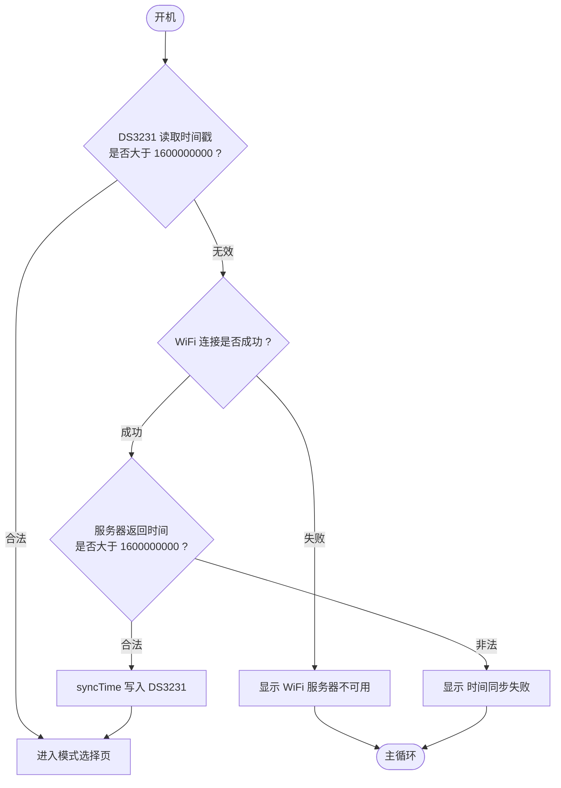

# FruitQualityMonitoringSystem（水果品质监测系统）

> **项目编号**：FruitQualityMonitoringSystem
>
> **本文档**以实际代码实现为准，完整覆盖设备端（ESP32 + Arduino）、后端服务器（C++）、前端可视化平台（Web）三个模块的所有功能，并严格对齐 `SWS需求文档.md` 中的架构设计规范。

---

## 一、项目概述

### 1.1 背景与目标

本系统旨在解决冷链运输与仓储场景下水果品质监控难、人工抽检破坏性强、无法实时追踪的问题。通过多光谱传感器与气体传感器融合，结合 MLR（多元线性回归）糖度算法与腐败气体融合算法，实现水果糖度与腐败程度的精准无损检测，并将数据上传至云端服务器，最终在 Web 端以可视化大屏呈现，同时支持腐败预警与无人机应急响应。

**核心检测指标**：

| 指标 | 检测方式 | 算法 | 精度 |
|------|---------|------|------|
| 糖度（Brix） | AS7341 多光谱 | MLR 吸光度模型 | ±0.3 Brix |
| 腐败程度 | MQ-135 + MQ-137 气体传感器 | 双气体归一化融合 | 定性 0~100% |
| 环境温湿度 | SHT31 | 直接读取 | ±0.2℃ / ±1.5%RH |
| 环境光照 | BH1750 | 直接读取 | ±20% |

### 1.2 系统分层架构

| 层级 | 名称 | 职责 | 技术栈 |
|------|------|------|--------|
| 感知层 | FieldAcquisitionTerminal | 数据采集（光谱/温湿度/光照/腐败气体）、本地计算糖度、HTTP 上传、离线缓存 | ESP32、Arduino UNO、AS7341、SHT31、BH1750、MQ-135、MQ-137、LVGL |
| 服务层 | FieldDataProcessingServer | 设备认证、数据接收、糖度算法计算、腐败度计算、MySQL 存储、接口提供、快腐败队列管理 | C++17、cpp-httplib、MySQL、libsodium（Argon2） |
| 应用层 | FieldMonitoringPlatform | 前台展示、管理员登录、单设备监控、糖度/腐败度/环境图表、均值统计、腐败预警 | HTML5/CSS3/ES6+、ECharts v5、Cookie |
| 响应层 | DroneModule | 无人机应急响应、快腐败预警广播、GPS自主导航 | Pixhawk 2.4.5、数传电台、机载广播系统 |

### 1.3 系统架构总图

```mermaid
flowchart LR
    subgraph 感知层["感知层 - FieldAcquisitionTerminal"]
        direction LR
        subgraph ArduinoUNO["Arduino UNO"]
            A1["MQ-135 苯类气体<br/>ADC"]
            A2["MQ-137 乙醇气体<br/>ADC"]
            A3["OLED 0.96 SSD1306<br/>I2C"]
        end

        subgraph 主控ESP32["主控 ESP32"]
            E0["UART 接收气体数据<br/>DATA:G135/G137 9600bps"]
            E1["AS7341 光谱<br/>I2C"]
            E2["SHT31 温湿度<br/>I2C"]
            E3["BH1750 光照<br/>I2C"]
            E4["DS3231 RTC<br/>I2C"]
            E5["2.8 TFT LVGL<br/>SPI 触摸屏"]
            E6["本地糖度计算<br/>MLR Lambert-Beer"]
            E7["本地腐败度计算<br/>gas135+gas137融合"]
        end

        subgraph FPGA模块["FPGA 模块 (野火征途 Pro)"]
            F0["UART 接收触发指令<br/>CAM device_id token ts<br/>GPIO 26 115200bps"]
            F1["OV5640 摄像头<br/>DVP 640x480 JPEG"]
            F2["片外 SDRAM 缓存"]
            F3["SPI Master<br/>发送图像数据"]
        end

        subgraph 副控ESP32["副控 ESP32 (FPGA 端)"]
            S0["SPI Slave<br/>接收图像数据"]
            S1["WiFi 上传云端"]
        end
    end

    A1 --> A2
    A1 --> E0
    A2 --> E0
    E1 --> E6
    E0 --> E7
    F1 --> F2 --> F3
    E4 -.->|"UART TX GPIO26<br/>触发命令"| F0
    F3 -->|"SPI"| S0
    S0 --> S1

    主控ESP32 -->|"POST /api/device/upload<br/>multipart/form-data"| 服务端
    主控ESP32 -.->|"GET /api/device/time"| 服务端
    S1 -->|"POST /api/device/vision<br/>multipart/form-data"| 服务端

    subgraph 服务端["服务层 - FieldDataProcessingServer (C++)"]
        subgraph 设备接口["设备端接口"]
            S1["POST /api/device/upload<br/>Token认证 MLR糖度 成熟度 腐败度<br/>写入 fruit_data / field_environment<br/>响应携带 server_time"]
            S2["POST /api/device/vision<br/>Token认证 图片落盘 VisionQueue<br/>ONNX推理消费线程 异步写入 fruit_vision_data"]
            S3["GET /api/device/time<br/>返回 server_time 供设备校时"]
        end

        subgraph 管理接口["管理端接口"]
            S4["POST /api/admin/login<br/>Argon2id验证 生成UUID Session<br/>Set-Cookie HttpOnly 1小时TTL"]
            S5["POST /api/admin/logout<br/>销毁 Session Cookie"]
            S6["GET /api/admin/field/list<br/>产区列表 field_production 品种信息"]
            S7["GET /api/admin/fruit/list<br/>设备最新数据 INNER JOIN 糖度成熟度"]
            S8["GET /api/admin/fruit/history<br/>84天糖度历史 LEFT JOIN 环境数据 图片"]
            S9["GET /api/admin/field/environment<br/>84天环境历史 SpoilCalc实时计算腐败度"]
        end

        subgraph 无人机接口["无人机接口"]
            S10["GET /api/drone/fast-decay/queue<br/>设备Token认证 返回快腐败队列<br/>腐败度>60%樱桃列表、自动过期清理"]
        end

        subgraph 静态资源["静态文件托管"]
            S11["GET /{所有路径}<br/>index.html admin/ login.html<br/>dashboard.html js/ css/ assets/"]
        end
    end

    服务端 -->|"Cookie: session_id<br/>GET /api/admin/{路径}"| 应用前端

    subgraph 应用前端["应用层 - FieldMonitoringPlatform (Web)"]
        W1["index.html<br/>产品介绍 登录入口"]
        W2["admin/login.html<br/>管理员登录页"]
        W3["admin/dashboard.html<br/>ECharts 监控大屏"]
        W4["js/api.js<br/>BASE_URL 封装"]
        W5["js/chart.js<br/>renderFruitHistoryChart<br/>renderEnvHistoryCharts"]
        W6["js/auto_switch.js<br/>60s自动切换产区 6s刷新<br/>4档时间刻度 Vision面板"]
        W7["assets/uploads/<br/>设备图片存储"]
    end

    W1 --> W2 --> W3
    W3 --> W4
    W3 --> W5
    W3 --> W6
    W6 --> W7
```



---

## 二、项目文件目录架构

```
FruitQualityMonitoringSystem/
├── FieldAcquisitionTerminal/       # ESP32 + Arduino 边缘采集终端（PlatformIO）
│   ├── config.h                   # 全局宏定义（WiFi、服务器、I2C/SPI 引脚、蜂鸣器、串口）
│   ├── platformio.ini             # PlatformIO 工程配置（开发板、库依赖）
│   └── src/
│       ├── main.cpp               # 入口点：setup() + loop()、状态机、串口监听
│       ├── algorithm/
│       │   └── sugar_calc.h       # ESP32 端 MLR 糖度计算（Lambert-Beer 模型）
│       ├── display/
│       │   ├── lvgl_ui.h          # UIManager 类声明（模式枚举、回调、控件成员）
│       │   └── lvgl_ui.cpp        # LVGL 触摸屏：启动页/模式选择/测试模式/工业模式
│       ├── network/
│       │   ├── HttpClient.h       # NetworkManager 类声明
│       │   └── HttpClient.cpp     # connectWiFi、maintainWiFi、fetchServerTime、uploadData
│       ├── sensor_driver/
│       │   ├── SensorManager.h    # SensorManager：AS7341、SHT31、BH1750、Serial2 封装
│       │   ├── SensorManager.cpp  # readEnvironment、readSpectrum、loop（串口监听）
│       │   ├── RTCManager.h       # RTCManager 单例：DS3231 + 系统时钟
│       │   ├── RTCManager.cpp     # begin、getTimestamp、syncTime（UTC+8）、formatTime
│       │   ├── BuzzerManager.h    # BuzzerManager 单例（非阻塞异步蜂鸣）
│       │   └── BuzzerManager.cpp  # beep()、loop() -- 高层触发接口
│       └── storage/
│           ├── StorageManager.h    # StorageManager 单例：LittleFS JSONL 记录 I/O
│           └── StorageManager.cpp  # begin、saveRecord、checkAndCleanCapacity、
│                                   # getUnuploadedRecord、markAsUploaded
│
├── FieldDataProcessingServer/      # C++ 后端服务器（CMake 构建）
│   ├── CMakeLists.txt             # CMake 配置：C++17、Threads、MySQL、libsodium
│   ├── config.ini                 # 服务器配置（数据库连接参数）
│   ├── models/                   # ONNX 模型文件目录
│   │   └── cherry_convnext_tiny.onnx   # ConvNeXt-Tiny 推理模型（10 类输出）
│   ├── sql/
│   │   └── init_db.sql           # 6 张表 DDL + 种子数据（含 fruit_vision_data）
│   ├── third_party/
│   │   └── httplib/httplib.h    # cpp-httplib v0.x HTTP 服务器（单头文件）
│   └── src/
│       ├── main.cpp              # 入口：libsodium 初始化、数据库连接、启动服务器
│       ├── auth/
│       │   ├── AdminAuth.h       # AdminAuth::login 声明（Argon2 + session）
│       │   ├── AdminAuth.cpp     # 查询 admin_users，验证 Argon2 哈希，颁发 session
│       │   ├── DeviceAuth.h      # DeviceAuth::authenticate 声明
│       │   └── DeviceAuth.cpp    # 查询 device_auth 表，检查 status=1
│       ├── data_process/
│       │   ├── DataCheck.h       # DataCheck::isEnvironmentValid、isFieldExist
│       │   ├── DataCheck.cpp     # 校验环境数据（非全99.0）、检查产区是否注册
│       │   ├── MaturityCalc.h    # MaturityCalc::calculate（brix/产区阈值）
│       │   ├── MaturityCalc.cpp  # 查询 field_production 阈值，返回成熟度比例
│       │   ├── SpoilCalc.h       # SpoilCalc::calculate（gas135 + gas137 融合）
│       │   ├── SpoilCalc.cpp     # 双气体风险归一化 + 加权融合 + 温湿度修正
│       │   ├── SugarCalc.h        # SugarCalc::calculate（MLR 光谱计算糖度）
│       │   └── SugarCalc.cpp     # Lambert-Beer 吸光度模型
│       ├── db/
│       │   ├── MySQLDriver.h     # MySQLDriver 单例：connect、execute、query
│       │   └── MySQLDriver.cpp   # mysql_real_connect/query/escape_string，
│       │                          线程安全互斥锁，结果集为 vector<map<string,string>>
│       ├── http_server/
│       │   ├── HttpServer.h      # HttpServer 类：start/stop（封装 httplib::Server）
│       │   ├── HttpServer.cpp    # 构造函数注册路由，设置静态目录挂载
│       │   └── Router.cpp        # 所有 API 路由处理函数（含 /api/device/vision）
│       ├── session/
│       │   └── Session.h         # Session 单例：createSession、isValid、destroySession
│       │       └── Session.cpp   # UUID 会话（32 位十六进制），1 小时 TTL
│       ├── vision/
│       │   ├── ImageProcessor.h/cpp    # 图像预处理
│       │   ├── ONNXInference.h/cpp    # ONNX 推理
│       │   ├── VisionTask.h          # VisionTask 结构体 + VisionTaskProcessor 声明
│       │   └── VisionTask.cpp         # 单线程消费队列：图像预处理 + ONNX 推理 + 入库
│       ├── drone/
│       │   ├── FastDecayQueue.h      # 快腐败队列单例
│       │   └── FastDecayQueue.cpp    # 队列管理、过期清理、ISO8601 时间戳
│       └── utils/
│           ├── Logger.h               # 日志系统单例（DEBUG/INFO/WARN/ERROR）
│           └── Logger.cpp              # 日志写入文件 + 控制台
│           └── PasswordHasher.h       # PasswordHasher::hash、verify（libsodium Argon2i）
│               └── PasswordHasher.cpp
│
└── FieldMonitoringPlatform/        # Web 前端（樱桃深红主题）
    ├── index.html                 # 产品介绍首页（樱桃红粒子动画 + 架构图）
    ├── assets/
    │   ├── libs/echarts.min.js  # ECharts v5（离线部署，防断网）
    │   └── images/              # hero-orchard.jpg, cherry-closeup.jpg 等
    └── admin/
        ├── login.html            # 管理员登录页（樱桃粉主题）
        ├── dashboard.html        # 监控大屏（糖度/腐败度/环境四图）
        ├── css/style.css         # 深红主题样式表
        └── js/
            ├── api.js            # BASE_URL，login()、logout() 封装
            ├── chart.js          # ECharts 初始化、renderFruitHistoryChart、
            │                      renderEnvHistoryCharts
            └── auto_switch.js    # 产区自动切换（60s 空闲）、数据刷新（6s 间隔）、
                                   changeScale、reloadAllChartsData、idleTimer 管理
```

---

## 三、系统功能架构

### 3.1 FieldAcquisitionTerminal（樱桃品质采集终端）

> **终端由三部分组成：主控 ESP32、FPGA 模块、副控 ESP32。** 主控 ESP32 通过 UART 向 FPGA 发送触发命令，FPGA 采集图像后通过 SPI 将数据传给副控 ESP32，副控 ESP32 通过 WiFi 上传至云端。

```mermaid
flowchart LR
    subgraph 终端["FieldAcquisitionTerminal"]
        A["Arduino UNO\n气体传感器主控"]
        E["ESP32\n主控中枢"]
        FPGA["FPGA\n野火征途 Pro"]
        F["ESP32\n副控中枢\nFPGA端"]
    end

    subgraph 传感器["传感器层"]
        MQ135["MQ-135 苯类气体\nADC"]
        MQ137["MQ-137 乙醇气体\nADC"]
        AS7341["AS7341 多光谱\nI2C"]
        SHT31["SHT31 温湿度\nI2C"]
        BH1750["BH1750 光照\nI2C"]
        DS3231["DS3231 RTC\nI2C"]
        OV5640["OV5640 摄像头\nDVP"]
    end

    subgraph 执行器["执行器层"]
        OLED["0.96 OLED\nSSD1306 I2C"]
        TFT["2.8 TFT LVGL\nSPI 触摸屏"]
    end

    MQ135 --> A
    MQ137 --> A
    A -->|UART 9600bps\nDATA:G135/G137| E
    AS7341 --> E
    SHT31 --> E
    BH1750 --> E
    DS3231 --> E
    OLED --> A
    E --> TFT
    E -->|"UART TX GPIO26\n触发命令| CAM...| FPGA
    OV5640 -->|"DVP 640x480 JPEG"| FPGA
    FPGA -->|"SPI Master"| F
    F -->|"WiFi| 云端["云端 服务层"]

    E -->|"POST /api/device/upload"| 云端
```

#### 子模块 A：Arduino UNO（气体传感器主控）

```
Arduino UNO 模块（气体采集）
├─ 传感器采集模块
│  ├─ MQ-135 苯类气体传感器  → ADC 采集 → gas135 ppm
│  └─ MQ-137 乙醇气体传感器  → ADC 采集 → gas137 ppm
├─ 通信模块
│  ├─ 串口发送（TX→ESP32 RX）
│  └─ 发送频率：每 5 秒主动上报一次气体数据
└─ 显示模块
   └─ 0.96 寸 I2C OLED（SSD1306）本地显示两气体浓度
```

- **供电**：USB 5V 或外部 5V 电源
- **通信协议**：纯文本字符串，9600 bps，8N1，换行符 `\n` 结尾
- **发送格式**：`DATA:G135:<gas135值>,G137:<gas137值>\n`
- **示例**：`DATA:G135:150.5,G137:200.3\n`

#### 子模块 B：ESP32（主控中枢）

```
ESP32 模块（主控中枢）
├─ 传感器数据采集模块
│  ├─ 多光谱采集（AS7341 → 10 通道原始值）
│  ├─ 温湿度采集（SHT31 → 温度/湿度）
│  ├─ 光照采集（BH1750 → 光照强度）
│  └─ 串口接收气体数据（从 Arduino UNO，Serial2）
├─ 本地计算模块
│  ├─ 光谱 → 糖度（MLR Lambert-Beer 模型，输出 0~20 Brix）
│  └─ 气体 → 腐败度（gas135 + gas137 归一化融合，输出 0~100%）
├─ 串口通信模块
│  ├─ Serial2 接收（RX=GPIO35, TX=GPIO21）
│  └─ 解析 Arduino 发来的气体字符串
├─ 本地显示模块（TFT + LVGL，2.8 寸 ILI9341）
│  ├─ 开机登录页面（设备编号 + 品种 + 同步状态）
│  ├─ 模式选择页面（测试模式 / 工业模式）
│  ├─ 测试模式页面（单次检测，糖度 + 腐败度）
│  └─ 工业模式页面（实时数据 + 历史记录 + 倒计时）
├─ 网络通信模块
│  ├─ WiFi 连接与重连（非阻塞）
│  ├─ HTTP 数据上传
│  └─ 时间同步握手
└─ 本地存储模块
   └─ LittleFS 离线数据持久化（JSONL 格式）
```

#### ESP32 端串口接收逻辑

1. ESP32 在 `loop()` 中持续调用 `sensorMgr.loop()` 监听 `Serial2` 缓冲区
2. 读到 `\n` 时，拼接完整字符串
3. 匹配前缀 `DATA:G135:` 和 `G137:`，提取两路 ppm 值
4. 存入全局变量，供本地计算和屏幕显示
5. 合并到 HTTP 上报报文的 `gas135` / `gas137` 字段中
6. 默认值：`gas135=99.0`, `gas137=99.0`（Arduino 未连接时的容错值）

#### ESP32 HTTP 上报报文结构

```json
{
  "spectrum_json": {
    "ch415":123,"ch445":456,"ch480":789,"ch515":234,
    "ch555":567,"ch595":890,"ch640":321,"ch680":654,
    "chClear":999,"chNIR":111
  },
  "gas135": 150.5,
  "gas137": 200.3,
  "temperature": 4.5,
  "humidity": 85.2,
  "light": 100,
  "collected_at": 1712345678
}
```

> **注意**：实际代码中气体字段直接作为顶层字段上传（`gas135` / `gas137`），而非嵌套在 `gas_json` 对象中。

**HTTP 请求头**：`device_id` + `token`

#### ESP32 本地屏幕显示内容

| 区域 | 内容 | 说明 |
|------|------|------|
| 顶部状态栏 | 糖度 Brix | 大字号数字 |
| 中部主显示 | 腐败程度 | 百分比（0~100%）+ 颜色指示 |
| 环境数据区 | 温度/湿度/光照 | 三行数字 |
| 原始数据区 | 光谱 10 通道 | 小字号列表 |
| 气体数据区 | gas135 / gas137 | 从 Arduino 接收的 ppm 值 |
| 底部状态栏 | WiFi 状态/时间 | 连接状态 + 当前时间 |

---

### 3.2 FieldDataProcessingServer（樱桃冷链数据处理中心）

```
水果冷链数据处理中心
├─ HTTP 服务模块
│  ├─ 监听端口 9000、解析请求、封装响应
│  └─ 静态文件托管（前端 Web）
├─ 设备认证模块
│  ├─ 校验 Header 中 device_id+token（device_auth 表）
│  └─ 设备状态校验（status=1）
├─ 数据接收模块
│  ├─ 接收上传数据：设备编号、光谱、gas135、gas137、温度、湿度、光照
│  ├─ 从 JSON 读取数据采集时间戳（优先）
│  └─ 备用：使用服务器收到时刻作为时间戳
├─ 数据校验模块
│  ├─ 设备有效性校验（status=1）
│  ├─ 环境数据校验（温度/湿度/光照三项不能全为 99）
│  └─ 产区号合法性校验（匹配 field_production 表）
├─ 数据计算模块
│  ├─ 光谱 → 糖度计算（MLR Lambert-Beer 吸光度模型）
│  └─ 糖度 → 成熟度计算（maturity_score = sugar_brix / mature_sugar_threshold）
├─ 腐败度计算模块
│  └─ 气体 → 腐败度（SpoilCalc：gas135 + gas137 双气体归一化融合）
├─ 视觉推理模块（Vision_AI_Extension）
│  ├─ VisionTaskProcessor 单例（线程安全任务队列）
│  ├─ POST /api/device/vision 图片上传接口（快速响应 + 队列入队）
│  ├─ 支持两种上传模式：multipart/form-data（ESP32）和 octet-stream（FPGA）
│  ├─ 视觉消费线程：单线程 while(true) 循环从队列取任务
│  ├─ ONNX 可用性检查：initialize()，不可用则 quality_level = -1
│  ├─ 图像预处理：stb_image 解码 → CenterCrop(640→480) → Resize(480→224)
│  ├─ ImageNet 归一化：mean=[0.485,0.456,0.406] std=[0.229,0.224,0.225]
│  ├─ ONNX 推理：ConvNeXt-Tiny → quality_level 1~10（或 -1 推理失败）
│  └─ 写入 fruit_vision_data 表（图片路径 + 品质等级）
├─ 数据库存储模块
│  ├─ 樱桃信息表写入（fruit_data：糖度 + 成熟度 + 光谱 JSON）
│  ├─ 仓库环境表写入（field_environment：含 gas135_ppm + gas137_ppm）
│  ├─ 视觉数据表写入（fruit_vision_data：品质等级 + 图片路径）
│  └─ 设备认证表、管理员信息表
├─ 日志模块（Logger）
│  ├─ Logger 单例（线程安全，递归互斥锁）
│  ├─ 日志分级：DEBUG / INFO / WARN / ERROR
│  ├─ 同时输出到文件和控制台
│  ├─ 按日期自动分割日志文件
│  └─ HTTP 请求日志记录（method、endpoint、device_id、status、bytes）
├─ 预警决策模块
│  └─ 腐败度阈值检测（>60% 触发前端红色告警 + 快腐败队列入队）
├─ 快腐败队列管理模块
│  ├─ FastDecayQueue 单例（内存存储，线程安全）
│  ├─ 腐败度 >60% 樱桃自动入队（数据上传时触发）
│  ├─ 队列过期清理机制（默认24小时自动清除）
│  ├─ 无人机查询接口（GET /api/drone/fast-decay/queue）
│  └─ ISO 8601 时间戳生成
└─ 接口服务模块
   ├─ 设备数据上传接口（支持气体数据）
   ├─ 设备图片上传接口（视觉推理，独立通道）
   ├─ 设备时间同步接口
   ├─ 管理员登录/登出接口
   ├─ 产区列表接口
   ├─ 糖度历史查询接口
   ├─ 腐败度历史查询接口（从 field_environment 读取 gas135/gas137 计算）
   └─ 环境数据查询接口
```

---

### 3.3 FieldMonitoringPlatform（樱桃冷链监测可视化平台）

> **核心设计**：单设备持续监控 + 实时均值统计 + 腐败预警

```
水果冷链监测可视化平台（樱桃深红主题 UI）
├─ 后台监控模块
│  ├─ 顶部：产区切换器（◀/▶）、当前产区信息（品种/设备数量）、系统时间、注销按钮
│  ├─ 实时统计面板
│  │   ├─ 最新糖度（Brix）+ 成熟度（%）
│  │   ├─ 最新腐败度（%）
│  │   ├─ 最新气体浓度（gas135 / gas137 ppm）
│  │   ├─ 检测次数
│  │   └─ 最新检测时间
│  ├─ AI 视觉分析档案（Vision 面板）
│  │   ├─ 视觉品质徽章（quality_level：-1=推理失败 / 1~3=劣等 / 4~7=中等 / 8~10=优等）
│  │   ├─ 实时拍摄照片展示（image_url，1:1 正方形）
│  │   └─ 推理失败时灰色警告徽章（⚠）
│  ├─ 左上：樱桃糖度历史折线图（ECharts，4 档时间刻度）
│  ├─ 右上：温度趋势图 + 湿度趋势图（纵向两图）
│  ├─ 右下：光照趋势图 + 腐败度折线图（纵向两图，红色渐变区域）
│  ├─ 下部：设备水果卡片阵列（糖度 + 成熟度 + 离线告警）
│  ├─ 设备分页（当前设备/总数量）
│  └─ 每 6 秒静默刷新 + 均值更新
├─ 历史数据展示模块
│  └─ 设备卡片内：Time/Sugar/Spoilage/gas135/gas137/Temp/Hum
├─ 腐败预警模块
│  ├─ 实时腐败度监控（>60% 红色告警面板）
│  └─ 阈值颜色渐变（0~30%绿 / 30~60%黄 / >60%红）
```

---

## 四、数据库设计

### 4.1 数据库选型与命名

- **数据库名称**：`FruitDataBase`
- **字符集**：`utf8mb4`
- **排序规则**：`utf8mb4_unicode_ci`
- **存储引擎**：InnoDB

### 4.2 表结构总览

| 表名 | 说明 | 主键 |
|------|------|------|
| `admin_users` | 管理员信息表 | `id` |
| `device_auth` | 设备认证表 | `device_id` |
| `field_production` | 产区生产信息表 | `field_id` |
| `fruit_data` | 樱桃糖度数据表 | `(device_id, collected_at)` |
| `field_environment` | 仓库环境数据表（含气体） | `(field_id, collected_at)` |

|| `fruit_vision_data` | 视觉数据表（AI品质+图片路径） | `(device_id, collected_at)` |

### 4.3 完整建表语句

```sql
-- ============================================
-- 水果冷链品质检测系统 数据库初始化脚本
-- 数据库名：FruitDataBase
-- 版本：v4.1（新增无人机应急响应模块）
-- ============================================

CREATE DATABASE IF NOT EXISTS FruitDataBase
    DEFAULT CHARSET=utf8mb4
    COLLATE=utf8mb4_unicode_ci;

USE FruitDataBase;

-- ============================================
-- 1. 管理员信息表
-- ============================================
CREATE TABLE IF NOT EXISTS admin_users (
    id INT PRIMARY KEY AUTO_INCREMENT,
    username VARCHAR(64) NOT NULL UNIQUE COMMENT '管理员账号（唯一）',
    password_hash VARCHAR(255) NOT NULL COMMENT 'Argon2 哈希后的密码',
    role TINYINT NOT NULL DEFAULT 1 COMMENT '角色：0=超级管理员，1=普通管理员',
    created_at TIMESTAMP DEFAULT CURRENT_TIMESTAMP COMMENT '创建时间',
    updated_at TIMESTAMP DEFAULT CURRENT_TIMESTAMP ON UPDATE CURRENT_TIMESTAMP COMMENT '更新时间'
) ENGINE=InnoDB DEFAULT CHARSET=utf8mb4 COLLATE=utf8mb4_unicode_ci;

-- ============================================
-- 2. 设备校验表
-- ============================================
CREATE TABLE IF NOT EXISTS device_auth (
    device_id VARCHAR(32) PRIMARY KEY COMMENT '设备编号：产区号-组号-设备号',
    token VARCHAR(64) NOT NULL UNIQUE COMMENT '设备唯一认证Token',
    status TINYINT NOT NULL DEFAULT 1 COMMENT '状态：0=禁用，1=启用',
    created_at TIMESTAMP DEFAULT CURRENT_TIMESTAMP COMMENT '创建时间'
) ENGINE=InnoDB DEFAULT CHARSET=utf8mb4 COLLATE=utf8mb4_unicode_ci;

-- ============================================
-- 3. 产区生产信息表
-- ============================================
CREATE TABLE IF NOT EXISTS field_production (
    field_id VARCHAR(16) PRIMARY KEY COMMENT '产区号',
    fruit_variety VARCHAR(64) NOT NULL COMMENT '水果品种',
    mature_sugar_threshold DECIMAL(5,2) NOT NULL COMMENT '成熟糖度阈值',
    created_at TIMESTAMP DEFAULT CURRENT_TIMESTAMP COMMENT '创建时间',
    updated_at TIMESTAMP DEFAULT CURRENT_TIMESTAMP ON UPDATE CURRENT_TIMESTAMP COMMENT '更新时间'
) ENGINE=InnoDB DEFAULT CHARSET=utf8mb4 COLLATE=utf8mb4_unicode_ci;

-- ============================================
-- 4. 樱桃果实信息表
-- ============================================
CREATE TABLE IF NOT EXISTS fruit_data (
    device_id VARCHAR(32) NOT NULL COMMENT '设备编号',
    collected_at INT NOT NULL COMMENT '数据采集时间戳（秒级）',
    sugar_brix DECIMAL(5,2) NOT NULL COMMENT '当前糖度值（MLR算法）',
    maturity_score DECIMAL(5,3) NOT NULL COMMENT '成熟度评分',
    spectrum_json JSON NOT NULL COMMENT 'AS7341光谱数据',
    PRIMARY KEY (device_id, collected_at)
) ENGINE=InnoDB DEFAULT CHARSET=utf8mb4 COLLATE=utf8mb4_unicode_ci;

-- ============================================
-- 5. 环境信息表（新增腐败气体字段）
-- ============================================
CREATE TABLE IF NOT EXISTS field_environment (
    field_id VARCHAR(16) NOT NULL COMMENT '产区号',
    collected_at INT NOT NULL COMMENT '数据采集时间戳',
    temperature_c DECIMAL(5,2) NOT NULL COMMENT '温度（℃）',
    humidity_rh DECIMAL(5,2) NOT NULL COMMENT '湿度（%RH）',
    light_lux INT NOT NULL COMMENT '光照强度（Lux）',
    gas135_ppm DECIMAL(6,2) NOT NULL DEFAULT 99.0 COMMENT '苯类等空气质量浓度（ppm）',
    gas137_ppm DECIMAL(6,2) NOT NULL DEFAULT 99.0 COMMENT '乙醇浓度（ppm）',
    PRIMARY KEY (field_id, collected_at)
) ENGINE=InnoDB DEFAULT CHARSET=utf8mb4 COLLATE=utf8mb4_unicode_ci;

-- ============================================
-- 6. 视觉数据表（多模态AI视觉扩展模块）
-- ============================================
CREATE TABLE IF NOT EXISTS fruit_vision_data (
    device_id VARCHAR(32) NOT NULL COMMENT '设备编号',
    collected_at INT NOT NULL COMMENT '采集时间戳（与fruit_data绝对对齐）',
    quality_level TINYINT NOT NULL DEFAULT 0 COMMENT 'AI评估品质梯度(1~10级)，-1表示ONNX不可用/推理失败',
    image_url VARCHAR(255) NOT NULL COMMENT '服务器本地图片相对路径',
    PRIMARY KEY (device_id, collected_at)
) ENGINE=InnoDB DEFAULT CHARSET=utf8mb4 COLLATE=utf8mb4_unicode_ci;

-- ============================================
-- 初始测试数据
-- ============================================

-- 初始管理员 admin/admin123（C++ 代码首次启动时自动刷新为 Argon2）
INSERT INTO admin_users (username, password_hash, role) VALUES
('admin', '$2b$12$LQv3c1yqBWVHxkd0LHAkCOYz6TtxMQJqhN8/X4bAq/xxx-placeholder', 0);

-- 注入樱桃产区信息（樱桃成熟糖度在 14.5 ~ 18.0 左右）
INSERT INTO field_production (field_id, fruit_variety, mature_sugar_threshold) VALUES
('1001', 'Bing Cherry (冰樱桃)', 15.00),
('1002', 'Rainier Cherry (雷尼尔)', 16.50),
('1003', 'Brooks Cherry (布鲁克斯)', 14.50);

-- 注入设备权限
INSERT INTO device_auth (device_id, token, status) VALUES
('1001-01-01', 'device-token-001', 1),
('1001-01-02', 'device-token-002', 1),
('1002-01-01', 'device-token-003', 1);
```

### 4.4 数据库连接配置

```ini
# config.ini（实际代码中硬编码在 main.cpp 中）
[database]
host = 127.0.0.1
port = 3306
username = sws_user
password = Mhr289839.
database = FruitDataBase
charset = utf8mb4
```

> **注意**：数据库连接参数在 `main.cpp` 中硬编码，建议改为从 `config.ini` 读取以提高安全性。

### 4.5 ER 关系图

```
关系说明：

1. device_auth → field_production
   ├── 关系类型：1 : N
   ├── 关联键：device_id 的前缀（取前 4 位，如 "1001-01-02" → "1001"）
   └── 含义：1 个产区可包含多个设备

2. field_production → fruit_data
   ├── 关系类型：1 : N
   ├── 关联键：field_id ← device_id 前缀
   └── 含义：1 个产区可包含多条樱桃糖度记录

3. field_production → field_environment
   ├── 关系类型：1 : N
   ├── 关联键：field_id
   └── 含义：1 个产区可记录多条环境数据（含气体）

4. admin_users、device_auth
   └── 独立实体，不与其他表直接关联
```

---

## 五、接口文档

### 5.1 基础约定

| 项目 | 说明 |
|------|------|
| 通信协议 | HTTP/1.1 |
| 数据格式 | 请求/响应均为 JSON |
| 服务端地址 | `http://47.107.41.102:9000` |
| 设备编号规则 | 产区号-组号-设备号（例：`1001-01-01`） |
| 产区号解析规则 | 取设备编号前 4 位（如 `1001-01-01` → `1001`） |
| 时间戳 | 优先使用请求体 JSON 中的 `collected_at`，其次使用服务器时间（秒级） |
| 状态码 | 200=成功，401=认证失败，400=数据校验失败，500=服务器内部错误 |

### 5.2 设备端 → 服务端接口

#### 接口 1：樱桃数据上传

- **地址**：`POST /api/device/upload`
- **请求头**：`device_id` + `token`
- **请求体**：

```json
{
  "spectrum_json": {
    "ch415":123,"ch445":456,"ch480":789,"ch515":234,
    "ch555":567,"ch595":890,"ch640":321,"ch680":654,
    "chClear":999,"chNIR":111
  },
  "gas135": 150.5,
  "gas137": 200.3,
  "temperature": 4.5,
  "humidity": 85.2,
  "light": 100,
  "collected_at": 1712345678
}
```

- **服务端处理流程**：

  1. 设备 Token 认证（查询 `device_auth` 表，status=1）
  2. 从 `device_id` 解析产区号（取前 4 位，如 `1001-01-01` → `1001`）
  3. 校验产区号存在于 `field_production` 表
  4. 数据合法性校验：
     - 环境数据：若温度/湿度/光照三值**不全为 99**，写入 `field_environment`；否则跳过
     - 温度范围 -40~80℃、湿度 0~100%、光照 0~65535 Lux
  5. 获取采集时间戳：优先从 JSON 读取，若为 0 或负数则用服务器当前时间
  6. 若主键冲突（同一秒同一产区），返回 HTTP 500（由设备端断点续传机制重试）
  7. MLR 糖度计算 + 成熟度计算
  8. 同时写入 `fruit_data` 和 `field_environment` 表
  9. 响应中携带 `server_time` 供设备校时

- **成功响应**：

```json
{
  "code": 200,
  "msg": "数据上传成功",
  "data": {
    "sugar_brix": 14.5,
    "maturity_score": 0.967,
    "server_time": 1712345679
  }
}
```

- **失败响应**：
  - 401：`{"code":401,"msg":"认证失败：Token错误、设备不存在或已被禁用"}`
  - 400：`{"code":400,"msg":"该设备所属产区未在生产信息表中注册"}`

#### 接口 2：设备时间同步

- **地址**：`GET /api/device/time`
- **响应**：

```json
{"code":200,"msg":"时间同步成功","data":{"server_time":1712345678}}
```

#### 接口 3：视觉图片上传（多模态AI视觉扩展）

> **设计原则**：图片上传与 AI 推理完全解耦。即使 ONNX 模型不可用，图片依然正常落盘入库，`quality_level` 记为 `-1`，前端可独立验证图片传输链路。

- **地址**：`POST /api/device/vision`
- **请求头**：`device_id` + `token`
- **请求体**：`multipart/form-data`
  - `image`：JPEG 图片文件（OV5640 采集，640×480）
  - `collected_at`：采集时间戳（Unix 秒级，与 fruit_data 对齐）
- **服务端处理流程（快速响应层）**：

  1. 设备 Token 认证（查询 `device_auth` 表，status=1）
  2. 提取 `collected_at` 时间戳
  3. 图片文件落盘：`../../FieldMonitoringPlatform/assets/uploads/<device_id>_<timestamp>.jpg`
  4. 任务入队 `std::queue<VisionTask>`（包含 image_path、device_id、collected_at）
  5. **立刻返回** `200 OK`，绝不阻塞 HTTP 线程

- **服务端处理流程（单线程消费层，后台运行）**：

  1. 图像解码（stb_image）
  2. Center Crop（640×480 → 480×480）
  3. Resize（480×480 → 224×224）
  4. ImageNet 归一化（mean=[0.485,0.456,0.406], std=[0.229,0.224,0.225]）
  5. **ONNX 可用性检查**：
     - 若不可用：`quality_level = -1`，直接入库
     - 若可用：执行 ConvNeXt-Tiny 推理 → quality_level 1~10
  6. 写入 `fruit_vision_data` 表，释放图像内存

- **成功响应**：

```json
{"code":200,"msg":"图片上传成功，推理任务已入队"}
```

### 5.3 前端 → 服务端接口

#### 接口 1：管理员登录

- **地址**：`POST /api/admin/login`
- **请求体**：`{"username":"admin","password":"admin123"}`
- **服务端逻辑**：
  1. Argon2 验证密码 → 匹配 `admin_users` 表
  2. 生成 32 位十六进制 UUID Session ID → 存入内存（1 小时 TTL）
  3. 返回 `Set-Cookie: session_id=xxx; Path=/; HttpOnly; Max-Age=3600`
- **成功响应**：`{"code":200,"msg":"登录成功","role":0}`
- **失败响应**：`{"code":401,"msg":"账号或密码错误"}`

#### 接口 2：获取所有产区列表

- **地址**：`GET /api/admin/field/list`
- **认证**：Session Cookie
- **响应**：

```json
{
  "code": 200,
  "data": {
    "total": 3,
    "list": [
      {"field_id": "1001", "variety": "Bing Cherry (冰樱桃)"},
      {"field_id": "1002", "variety": "Rainier Cherry (雷尼尔)"},
      {"field_id": "1003", "variety": "Brooks Cherry (布鲁克斯)"}
    ]
  }
}
```

#### 接口 3：获取产区下所有设备最新数据

- **地址**：`GET /api/admin/fruit/list?field_id=1001`
- **认证**：Session Cookie + `field_id` 参数
- **SQL 逻辑**：INNER JOIN 查询每个设备 `collected_at` 最大的一条
- **响应**：

```json
{
  "code": 200,
  "data": [
    {
      "device_id": "1001-01-01",
      "sugar_brix": 13.5,
      "maturity_score": 0.9,
      "collected_at": 1712345678
    }
  ]
}
```

#### 接口 4：获取单设备糖度历史数据

- **地址**：`GET /api/admin/fruit/history?device_id=1001-01-01`
- **认证**：Session Cookie + `device_id` 参数
- **说明**：返回最近 84 天数据，按时间升序排列；通过 `LEFT JOIN fruit_vision_data` 聚合视觉数据，图片独立上传可能存在延迟
- **SQL 逻辑**：

```sql
SELECT
    f.collected_at, f.sugar_brix, f.maturity_score,
    e.temperature_c, e.humidity_rh, e.light_lux, e.gas135_ppm, e.gas137_ppm,
    v.quality_level, v.image_url
FROM fruit_data f
LEFT JOIN field_environment e ON f.device_id = e.field_id AND f.collected_at = e.collected_at
LEFT JOIN fruit_vision_data v ON f.device_id = v.device_id AND f.collected_at = v.collected_at
WHERE f.device_id = ? ORDER BY f.collected_at ASC
```

- **响应**：

```json
{
  "code": 200,
  "data": [
    {
      "timestamp": 1712340000,
      "sugar_brix": 13.2,
      "maturity_score": 0.88,
      "temperature": 4.5,
      "humidity": 82.1,
      "light": 150,
      "gas135_ppm": 120.5,
      "gas137_ppm": 180.3,
      "quality_level": 8,
      "image_url": "/assets/uploads/1001-01-01_1712340000.jpg"
    }
  ]
}
```

#### 接口 5：获取产区环境历史数据（含腐败度）

- **地址**：`GET /api/admin/field/environment?field_id=1001`
- **认证**：Session Cookie + `field_id` 参数
- **说明**：返回最近 84 天数据，腐败度由 `SpoilCalc::calculate()` 实时计算
- **响应**：

```json
{
  "code": 200,
  "data": [
    {
      "timestamp": 1712340000,
      "temperature": 4.2,
      "humidity": 85.0,
      "light": 100,
      "spoilage": 35.2
    }
  ]
}
```

#### 接口 6：管理员登出

- **地址**：`POST /api/admin/logout`
- **认证**：Session Cookie
- **响应**：`{"code":200,"msg":"登出成功"}`

### 5.4 无人机端 → 服务端接口

#### 接口 1：查询快腐败樱桃队列

- **地址**：`GET /api/drone/fast-decay/queue`
- **认证**：device_id + token（HTTP Header）
- **用途**：无人机定时查询快腐败樱桃队列，获取需要应急响应的目标设备信息

**请求示例**：

```
GET /api/drone/fast-decay/queue
device_id: 1001-01-01
token: device-token-001
```

**成功响应（200 OK）**：

```json
{
  "code": 200,
  "msg": "success",
  "data": {
    "hasFastDecayCherries": true,
    "cherries": [
      {
        "deviceId": "1001-01-01",
        "timestamp": "2026-05-02T14:20:00Z",
        "decayRate": 48.5
      },
      {
        "deviceId": "1001-01-02",
        "timestamp": "2026-05-02T13:45:00Z",
        "decayRate": 47.2
      }
    ]
  }
}
```

**无快腐败樱桃时的响应**：

```json
{
  "code": 200,
  "msg": "success",
  "data": {
    "hasFastDecayCherries": false,
    "cherries": []
  }
}
```

**响应字段说明**：

| 字段名 | 类型 | 必填 | 说明 |
|--------|------|------|------|
| hasFastDecayCherries | boolean | 是 | 队列中是否存在快腐败樱桃 |
| cherries | array | 是 | 快腐败樱桃列表（无数据时为空数组） |
| cherries[].deviceId | string | 是 | 监测设备ID（无人机据此解析设备位置） |
| cherries[].timestamp | string | 是 | 检测时间（ISO 8601格式） |
| cherries[].decayRate | float | 是 | 腐败程度百分比 |

**失败响应**：
- 401：`{"code":401,"msg":"认证失败：Token错误、设备不存在或已被禁用"}`

---

## 六、核心算法汇总

### 6.1 糖度 MLR 计算公式（Lambert-Beer 吸光度模型）

> ESP32 端（`sugar_calc.h`）和服务器端（`SugarCalc.cpp`）使用完全相同的算法，保证边缘与云端结果一致。

```
abs_555 = log10(chClear / (ch555 + 1.0))
abs_640 = log10(chClear / (ch640 + 1.0))
abs_680 = log10(chClear / (ch680 + 1.0))
abs_NIR  = log10(chClear / (chNIR  + 1.0))

raw_brix = -1.2 × abs_555 + 3.5 × abs_640 + 6.8 × abs_680 + 12.5 × abs_NIR - 2.5
sugar_brix = clamp(raw_brix, 0.0, 20.0)
```

- **安全门卫**：`chClear < 200.0` 或 `chNIR < 10.0` → 返回 `0.0`（无效光谱）
- **物理意义**：利用不同波长光在糖溶液中的吸收差异，通过吸光度与浓度的线性关系估算 Brix 值
- **系数来源**：基于 Lambert-Beer 定律对 AS7341 标定实验数据拟合

### 6.2 成熟度计算公式

```
maturity_score = sugar_brix / mature_sugar_threshold
```

- `mature_sugar_threshold`：该批次的成熟糖度阈值（由生产者注册到 `field_production` 表）
- 等于 1.0 表示刚好成熟，超过 1.0 表示过熟

### 6.3 腐败度计算公式（SpoilCalc）

```
// 容错处理：若两路气体均为 99.0（传感器未连接）→ 返回 0.0
if (gas135 == 99.0 && gas137 == 99.0) return 0.0;

// 气体风险归一化
risk135 = clamp((gas135 - 100.0) / 200.0, 0.0, 1.0)  // 100ppm 以下风险为0，300ppm 以上风险为1
risk137 = clamp((gas137 - 120.0) / 230.0, 0.0, 1.0)  // 120ppm 以下风险为0，350ppm 以上风险为1

// 加权融合（乙醇对于水果发酵腐败指示意义更大）
spoil_score = risk135 × 0.4 + risk137 × 0.6

// 转为百分比（0~100）
spoilage = spoil_score × 100.0
```

- **Arduino 标定参考**：MQ-135 新鲜 < 150 ppm，变质 > 300 ppm；MQ-137 新鲜 < 180 ppm，变质 > 350 ppm
- **预警阈值**：`spoilage > 60%` 触发前端红色告警面板

---

## 六点五、模型训练计算平台

> 本系统的 MLR 糖度回归模型与腐败度融合算法均在校阶段使用专用高性能主机进行离线训练与参数标定，训练数据来源于标准糖度计对照实验与气体传感器标定舱实验。

| 项目 | 规格 |
|------|------|
| CPU | AMD Ryzen 9 9950X3D（16 核 32 线程，Zen5 架构） |
| GPU | NVIDIA GeForce RTX 5090（32GB GDDR7，Blackwell 架构） |
| 内存 | 64GB DDR5 |
| 操作系统 | Linux / Windows（CUDA 兼容环境） |
| 训练框架 | NumPy / Scikit-learn / PyTorch（CUDA 加速） |
| 训练任务 | MLR 糖度模型参数拟合（Lambert-Beer 吸光度系数）、腐败度权重标定（gas135/gas137 加权系数）、温湿度修正因子调优 |
| 训练数据来源 | AS7341 光谱标定实验（不同浓度糖溶液光谱响应曲线）、MQ-135/MQ-137 气体标定舱实验（不同腐败阶段气体浓度曲线） |
| 模型部署方式 | 训练后参数以常量形式固化至 ESP32（`sugar_calc.h`）和服务器端（`SugarCalc.cpp`、`SpoilCalc.cpp`），无需在线推理 |

---

## 七、硬件清单

### 模块 1：糖度检测 / 数据汇总 / 数据上传（ESP32 主控）

| 序号 | 硬件 | 型号/规格 | 数量 | 说明 |
|------|------|---------|------|------|
| 1 | 主控芯片 | ESP32 DevKit V1 | 1 | 双核 240MHz，WiFi+蓝牙 |
| 2 | 光谱传感器 | GY-AS7341-V1 | 1 | 11 通道（8 可见光+白光+近红外），I2C 0x39 |
| 3 | 温湿度传感器 | SHT31 | 1 | 精度 ±0.2℃，I2C 0x44/0x45 |
| 4 | 光照传感器 | BH1750 | 1 | 量程 0~65535 Lux，I2C 0x23/0x5C |
| 5 | RTC 时钟 | DS3231 | 1 | I2C，断电保持 |
| 6 | 显示屏 | 2.8 寸 ILI9341 SPI TFT | 1 | 分辨率 240×320，SPI 接口 |
| 7 | 触摸芯片 | XPT2046 | 1 | SPI 触摸驱动 |
| 8 | 蜂鸣器 | 5V 两针无源蜂鸣器 | 1 | GPIO26 控制（**已禁用，当前用于 FPGA 通信**） |
| 9 | FPGA 通信串口 | ESP32 Serial1 | 1 | GPIO26(TX) 115200bps，向 FPGA 发送触发命令 |
| 10 | 气体通信串口 | ESP32 Serial2 | 1 | GPIO35(RX)/GPIO21(TX)，9600bps |
| 10 | 杜邦线、面包板 | — | 若干 | 原型搭建 |

**I2C 总线汇总**：GPIO27（SDA）、GPIO22（SCL）、3.3V、GND，四芯并联接入各 I2C 设备。

### 模块 2：腐败度检测 / 串口通信（Arduino UNO）

| 序号 | 硬件 | 型号/规格 | 数量 | 说明 |
|------|------|---------|------|------|
| 1 | 主控板 | Arduino UNO / Nano | 1 | 气体传感器采集主控 |
| 2 | 气体传感器 A | MQ-135 | 1 | 苯类等有毒气体，ADC 采集 |
| 3 | 气体传感器 B | MQ-137 | 1 | 乙醇/氨气，ADC 采集 |
| 4 | 分压电阻板 | 10kΩ + 20kΩ | 2 | MQ 系列传感器分压至 Arduino ADC 5V 范围 |
| 5 | OLED 显示屏 | 0.96 寸 I2C SSD1306 | 1 | 本地显示两路气体 ppm，地址 0x3C |
| 6 | 与 ESP32 通信 | UART D3(TX)/D4(RX) | 1 | SoftwareSerial，9600bps |
| 7 | 5V 电源模块 | AMS1117-5.0 | 1 | 稳压供电 |

### 模块 3：后端部署服务器（云服务器）

| 序号 | 硬件 | 型号/规格 | 说明 |
|------|------|---------|------|
| 1 | 公网 IP | 47.107.41.102 | 云服务器公网 IP，HTTP 端口 9000 |
| 2 | 操作系统 | Linux（CentOS/Ubuntu） | 后端服务运行平台 |
| 3 | Web 服务端口 | 9000 | cpp-httplib HTTP 服务器监听端口 |
| 4 | 数据库 | MySQL 5.7+ | 运行于本机，存储 `FruitDataBase` |
| 5 | 运行身份 | root 用户 | 守护进程由 root 启动（`nohup ./FieldDataProcessingServer &`） |

**服务部署架构**：

```
[ESP32 设备]  ──HTTP POST──►  [云服务器:9000]  ──►  [MySQL 数据库]
                                    │
                              [cpp-httplib]  ──►  [静态文件托管]
                                                  [Web 前端资源]
```

### 7.1 ESP32 完整引脚分配表

| 功能 | ESP32 引脚 | 说明 |
|------|-----------|------|
| TFT_MISO | GPIO19 | SPI 主机输入 |
| TFT_MOSI | GPIO23 | SPI 主机输出 |
| TFT_SCLK | GPIO18 | SPI 时钟 |
| TFT_CS | GPIO5 | TFT 片选 |
| TFT_DC | GPIO21 | 数据/命令选择 |
| TFT_RST | GPIO4 | 复位 |
| TFT_BL | — | 背光控制（代码中为宏，已在 tft 初始化时配置） |
| TOUCH_MISO | GPIO39 | 触摸 SPI MISO |
| TOUCH_MOSI | GPIO32 | 触摸 SPI MOSI |
| TOUCH_CLK | GPIO25 | 触摸 SPI 时钟 |
| TOUCH_CS | GPIO33 | 触摸芯片片选 |
| TOUCH_IRQ | GPIO36 | 触摸中断 |
| SDA | GPIO27 | I2C 数据线 |
| SCL | GPIO22 | I2C 时钟线 |
| BUZZER | GPIO26 | 蜂鸣器控制（已禁用，当前用于 FPGA 通信） |
| FPGA_UART_TX | GPIO26 | FPGA 触发命令发送 (Serial1 TX，115200bps) |
| GAS_RX | GPIO35 | Arduino 串口接收 |
| GAS_TX | GPIO21 | Arduino 串口发送 |

### 7.2 I2C 总线接线（SDA=GPIO27，SCL=GPIO22，所有 I2C 设备共用）

| 设备 | VCC (3.3V) | GND | SDA (GPIO27) | SCL (GPIO22) | 其他 |
|------|-----------|-----|-------------|-------------|------|
| SHT31 温湿度传感器 | ESP32 3.3V | ESP32 GND | GPIO27 | GPIO22 | ADDR 空置（0x44） |
| BH1750 光照传感器 | ESP32 3.3V | ESP32 GND | GPIO27 | GPIO22 | ADDR 空置（0x23） |
| AS7341 光谱传感器 | ESP32 3.3V | ESP32 GND | GPIO27 | GPIO22 | VIN→3.3V，INT 空置 |
| DS3231 RTC 模块 | ESP32 3.3V | ESP32 GND | GPIO27 | GPIO22 | — |

### 7.3 SPI 总线接线（TFT + 触摸共用 HSPI 总线）

| TFT ILI9341 | ESP32 | XPT2046 触摸 | ESP32 |
|-------------|-------|-------------|-------|
| CLK | GPIO18 | CLK | GPIO25 |
| MOSI | GPIO23 | MOSI | GPIO32 |
| MISO | GPIO19 | MISO | GPIO39 |
| CS | GPIO5 | CS | GPIO33 |
| DC | GPIO21 | — | — |
| RST | GPIO4 | — | — |
| BL | — | IRQ | GPIO36 |

### 7.4 传感器详细参数

#### AS7341 多光谱传感器

| 参数 | 值 |
|------|-----|
| 通信接口 | I2C（地址 0x39） |
| 光谱通道 | 11 个（ch415, ch445, ch480, ch515, ch555, ch595, ch640, ch680, Clear, NIR） |
| ADC 分辨率 | 16 位 |
| 动态范围 | 可配置增益（GAIN） |
| 工作电压 | 3.3V |
| 数据格式 | 整数（0~65535） |

**光谱通道波长对照**：

| 通道 | 中心波长 | 颜色 |
|------|---------|------|
| ch415 | 415nm | 紫色 |
| ch445 | 445nm | 蓝色 |
| ch480 | 480nm | 青蓝色 |
| ch515 | 515nm | 绿色 |
| ch555 | 555nm | 黄绿色 |
| ch595 | 595nm | 黄色 |
| ch640 | 640nm | 橙色 |
| ch680 | 680nm | 红色 |
| chClear | — | 白光（ Clear） |
| chNIR | — | 近红外（NIR） |

#### SHT31 温湿度传感器

| 参数 | 值 |
|------|-----|
| 通信接口 | I2C（地址 0x44 或 0x45） |
| 温度范围 | -40℃ ~ +125℃ |
| 温度精度 | ±0.2℃（典型） |
| 湿度范围 | 0% ~ 100% RH |
| 湿度精度 | ±1.5% RH（典型） |
| 工作电压 | 2.4V ~ 5.5V |
| 数据格式 | 浮点数 |

#### BH1750 光照传感器

| 参数 | 值 |
|------|-----|
| 通信接口 | I2C（地址 0x23 或 0x5C） |
| 光照范围 | 0 ~ 65535 Lux |
| 测量精度 | 1 Lux |
| 工作电压 | 3.3V ~ 5V |
| 数据格式 | 整数 |

#### MQ-135 / MQ-137 气体传感器

| 参数 | MQ-135 | MQ-137 |
|------|--------|--------|
| 检测气体 | 苯类、醇类、酮类等 | 乙醇、氨气 |
| 检测范围 | 10~1000 ppm | 10~500 ppm |
| 工作电压 | 5V（加热丝） | 5V（加热丝） |
| 输出类型 | 模拟电压 | 模拟电压 |
| 清洁空气参考值 | ~100 ppm | ~120 ppm |
| 典型变质阈值 | >300 ppm | >350 ppm |

---

## 八、关键业务规则

| 规则 | 说明 |
|------|------|
| 气体传感器未连接 | `gas135=99.0` 且 `gas137=99.0` → `SpoilCalc::calculate()` 返回 `0.0` |
| 环境数据无效 | 温度=99 AND 湿度=99 AND 光照=99 → 跳过 `field_environment` 写入，`fruit_data` 不受影响 |
| 主键冲突处理 | 同一秒同一产区重复上传 → 服务器返回 HTTP 500，设备端断点续传机制重试 |
| 设备禁用 | `device_auth.status=0` → HTTP 401 Unauthorized |
| 产区号校验 | 上传时必须校验产区号存在 `field_production` 表 |
| 时间戳优先级 | 优先采用请求体 JSON 中的 `collected_at`，否则用服务器时间 |
| 腐败预警阈值 | `spoilage > 60%` → 前端显示红色告警面板 |
| 快腐败队列触发 | `spoilage > 60%` → 自动加入快腐败队列供无人机查询 |
| 快腐败队列过期 | 队列项默认 24 小时（86400 秒）后自动清除 |
| Session 有效期 | 1 小时（3600 秒），HttpOnly Cookie |
| 设备端离线告警 | 当前时间 - `collected_at > 1800秒`（30 分钟）→ 卡片变灰+红色闪烁 |
| 糖度有效范围 | 0.0~20.0 Brix，超出钳制 |
| 光谱安全门卫 | `chClear < 200` 或 `chNIR < 10` → 糖度返回 0.0 |
| 批次号解析规则 | 取 `device_id` 前 4 位（如 `1001-01-01` → `1001`） |

---

## 九、ESP32 设备端详细说明

### 9.1 系统状态机

设备有三种运行状态，由 `SystemMode` 枚举控制：

```cpp
enum SystemMode {
    MODE_WAITING,    // 启动后等待时间同步
    MODE_TEST,       // 测试模式（本地检测，不上传）
    MODE_INDUSTRIAL  // 工业模式（定时检测，自动上传）
};
```

### 9.2 双模式详细说明

#### 测试模式（MODE_TEST）

- **触发条件**：时间同步成功后，点击屏幕"测试模式"按钮
- **测量方式**：用户手动点击"检测"按钮触发单次检测
- **数据处理**：
  - 本地内存计算（最多 20 条历史记录）
  - 环境数据（温湿度/光照/气体）**固定为 99**，不参与计算
  - 不上传服务器，不写 LittleFS
- **显示内容**：当前糖度、检测次数、累计均值、糖度历史列表
- **退出方式**：点击"返回"按钮，清零历史数据，回到启动页

#### 工业模式（MODE_INDUSTRIAL）

- **触发条件**：时间同步成功后，点击屏幕"工业模式"按钮
- **测量方式**：
  - 自动定时：每 `AUTO_UPLOAD_INTERVAL`（默认 5 分钟 = 300000 ms）自动触发
  - 手动触发：用户随时点击"立即检测"按钮
- **数据处理**：
  - 完整采集光谱 + 环境数据 + 气体数据
  - HTTP POST 上传到服务器
  - 同时写入 LittleFS（`/records.jsonl`）
  - 若上传失败，标记 `up=0`，等待网络恢复后补发
- **显示内容**：
  - 第一页（TileView Page 0）：糖度大数字、温度、湿度、光照、气体 ppm、下次检测倒计时
  - 第二页（TileView Page 1）：历史记录表格（时间/糖度/温/湿/光/上传状态 Y/N）
- **退出方式**：点击"返回"按钮，回到启动页（工业模式定时器停止）

### 9.3 离线数据恢复机制（断点续传）

设备维护两个关键状态变量实现断点续传：

```cpp
bool wasWiFiConnected = false;         // 上一帧 WiFi 状态
bool isRecoveringData = false;          // 是否正在补发
unsigned long recoverStartTime = 0;    // 补发开始时间戳
unsigned long recoverDelayDelay = 0;    // 随机延迟（0~10秒，防雪崩）
```

**触发场景**：

| 场景 | 触发条件 | 处理 |
|------|---------|------|
| A：网络恢复 | WiFi 从断开变为连接 | 随机延迟 0~10 秒后开始补发 |
| B：周期性巡检 | WiFi 连接中 + 每 15 秒检查 | 发现 `up=0` 记录则激活补发 |
| C：执行补发 | `isRecoveringData=true` 且随机延迟到期 | 按文件顺序查找 `up=0` 记录，依次补发 |

**补发流程**：

1. 查 LittleFS 中第一条 `up=0` 记录
2. 构造 HTTP POST 请求（保留原始 `collected_at`）
3. 若上传成功 → 标记 `up=1` → 继续下一条
4. 若上传失败 → 暂停，等 15 秒后再次巡检

### 9.4 时间同步机制（DS3231 + 服务器双重保障）




**运行中热同步**：WiFi 从断开变为连接时（`wasWiFiConnected` 边沿检测），自动重新请求服务器时间并写入 DS3231。

### 9.5 LVGL UI 页面详细布局

#### 启动页（Boot Screen）

- 淡绿色背景，深绿色字体
- 顶部：`Device ID: 1001-01-01`
- 中部：`Fruit: Cherry`
- 底部：实时状态文字（`"正在等待时间更新..."` / `"WIFI OK! Syncing SVR..."`）
- 时间同步成功后 → 自动跳转到**模式选择页**

#### 模式选择页（Mode Selection）

- 显示两个大按钮：
  - **测试模式**：用于消费者单次检测
  - **工业模式**：用于生产环境定时采集
- 按钮由 LVGL `lv_btn` 实现，带回调

#### 测试模式页（Test Mode）

- **顶部**：`Test Mode` 标签
- **中部**：
  - 当前糖度（大字号数字）
  - 检测次数 / 累计均值
  - 检测历史表格（No / Brix / Avg）
- **底部**：`开始检测` 按钮 + `清除` 按钮 + `返回` 按钮

#### 工业模式页（Industrial Mode）

双 TileView 页面（左右滑动切换）：

**Page 0（实时数据）**：

- 设备 ID 标签
- 糖度大数字 + 单位（Brix）
- 四格环境数据（温度/湿度/光照/气体）
- 下次检测倒计时进度条
- `立即检测` 按钮

**Page 1（历史记录）**：

- 表格列：Time / Brix / Temp / Hum / Light / Upload
- Upload 列显示 Y（绿色）或 N（红色）
- `返回` 按钮

---

## 十、Web 端樱桃主题样式

### 10.1 配色方案

| 用途 | 颜色 |
|------|------|
| 主色（背景/导航） | #8B0000（深红/樱桃红） |
| 辅色（卡片/面板） | #DC143C（绯红） |
| 强调色（按钮/高亮） | #FF6B6B（浅红） |
| 文字主色 | #FFFFFF（白色） |
| 文字次色 | #FFDAB9（桃色） |
| 图表配色 | #FF4500（橙红）、#FF6347（番茄红）、#FF7F50（珊瑚红） |
| 腐败告警 | #FF0000（纯红） |
| 腐败告警渐变 | 红色区域填充（0~100% opacity 渐变） |

### 10.2 页面布局

- **顶部导航栏**：深红背景，白色字体，显示系统标题
- **产区切换器**：深红色按钮组，左右切换
- **统计面板**：绯红色卡片，显示最新糖度、最新腐败度、气体 ppm
- **图表区域**：四个 ECharts 图表（糖度历史 / 温度趋势 / 湿度趋势 / 光照趋势 + 腐败度折线），深红色主题
- **告警面板**：红色边框高亮，`spoilage > 60%` 时面板变红并闪烁

---

## 十一、开发与部署

### 11.1 ESP32 设备端开发

**依赖库（platformio.ini）**：

```
framework = arduino
board = esp32dev
lib_deps =
    lvgl/lvgl@^8.3.0
    bodmer/TFT_eSPI@^2.5.0
    paul Stoffregen/XPT2046_Touchscreen@^1.4.0
    adafruit/Adafruit AS7341@^1.2.0
    adafruit/Adafruit SHT31 Library@^2.2.0
    claws/BH1750@^1.1.1
    adafruit/RTClib@^2.1.0
    bblanchon/ArduinoJson@^6.21.0
```

**编译与烧录**：

```bash
cd FieldAcquisitionTerminal
pio run --target upload          # 编译并烧录
pio run --target monitor         # 打开串口监视器（115200 baud）
```

**配置修改**（`config.h`）：

```cpp
#define DEVICE_ID       "1001-01-01"
#define FRUIT_VARIETY   "Cherry"
#define DEVICE_TOKEN    "device-token-001"
#define WIFI_SSID       "YourSSID"
#define WIFI_PASS       "YourPassword"
#define SERVER_URL      "http://47.107.41.102:9000/api/device/upload"
#define AUTO_UPLOAD_INTERVAL 300000  // 5分钟
```

### 11.2 后端服务器部署

**依赖**：

- CMake ≥ 3.10
- GCC/G++ ≥ 7（C++17 支持）
- MySQL 5.7+
- libsodium-dev
- libmysqlclient-dev

**编译**：

```bash
cd FieldDataProcessingServer
mkdir build && cd build
cmake .. && make -j4
```

**数据库初始化**：

```bash
mysql -u root -pMhr289839. < sql/init_db.sql
```

**启动**：

```bash
cd build
./FieldDataProcessingServer
# 或后台运行：
nohup ./FieldDataProcessingServer > server.log 2>&1 &
```

**守护进程配置（systemd）**：

```ini
# /etc/systemd/system/cherry-server.service
[Unit]
Description=Cherry Cold Chain Data Processing Server
After=network.target mysql.service

[Service]
Type=simple
User=root
WorkingDirectory=/path/to/FieldDataProcessingServer/build
ExecStart=/path/to/FieldDataProcessingServer/build/FieldDataProcessingServer
Restart=always
RestartSec=10

[Install]
WantedBy=multi-user.target
```

```bash
sudo systemctl daemon-reload
sudo systemctl enable cherry-server
sudo systemctl start cherry-server
```

### 11.3 Web 前端部署

前端静态文件由后端 C++ 服务器直接托管，无需独立部署：

```
http://47.107.41.102:9000/              → index.html（产品介绍）
http://47.107.41.102:9000/admin/login.html  → 登录页
http://47.107.41.102:9000/admin/dashboard.html → 监控大屏
```

**静态文件挂载规则**（`HttpServer.cpp`）：

| URL 路径 | 实际文件系统 |
|---------|-----------|
| `/` | `../../FieldMonitoringPlatform/index.html` |
| `/admin/login.html` | `../../FieldMonitoringPlatform/admin/login.html` |
| `/admin/dashboard.html` | `../../FieldMonitoringPlatform/admin/dashboard.html` |
| `/admin/css/*` | `../../FieldMonitoringPlatform/admin/css/*` |
| `/admin/js/*` | `../../FieldMonitoringPlatform/admin/js/*` |
| `/assets/*` | `../../FieldMonitoringPlatform/assets/*` |

---

## 十二、故障排查

### 12.1 ESP32 设备端

| 症状 | 可能原因 | 解决方案 |
|------|---------|---------|
| 屏幕不亮 | 接线松动/背光未开启 | 检查 SPI 线、确认 `TFT_BL` 高电平 |
| I2C 传感器不识别 | 地址冲突/SDA-SCL 接反 | 用 I2C Scanner 扫描确认地址 |
| 光谱数据全是 0 | AS7341 未正确初始化 | 检查 VIN 是否接 3.3V，确认 `Wire.begin()` |
| WiFi 连接失败 | SSID/密码错误/信号弱 | 检查 `config.h` 配置，确认路由器信号 |
| 数据上传失败（401） | device_id 或 token 不匹配 | 确认 `device_auth` 表中对应记录 |
| 时间一直是 1970 年 | DS3231 未连接/电池没电 | 检查 I2C 连接，确认 RTC 电池 |
| Arduino 气体数据全是 99 | 串口接线错误/波特率不匹配 | 确认 TX/RX 交叉接线，ESP32 用 9600 baud |

### 12.2 后端服务器

| 症状 | 可能原因 | 解决方案 |
|------|---------|---------|
| 启动失败 | MySQL 连接失败 | 检查 `config.ini` 账号密码，确认 MySQL 运行 |
| 所有请求返回 500 | 数据库表不存在 | 执行 `sql/init_db.sql` 初始化数据库 |
| Argon2 验证失败 | admin 密码哈希占位符未更新 | 服务器首次处理 admin 登录时自动刷新为真实 Argon2 哈希 |
| 静态文件 404 | 相对路径不对 | 确认 `HttpServer.cpp` 中路径相对于工作目录 `build/` |

### 12.3 Web 前端

| 症状 | 可能原因 | 解决方案 |
|------|---------|---------|
| 登录后跳转回登录页 | Session 未正确写入 Cookie | 确认浏览器接受 HttpOnly Cookie，检查 `/api/admin/login` 响应头 |
| 图表无数据 | API 请求失败 | 打开浏览器 F12 开发者工具，查看 Network 面板错误信息 |
| 产区切换无反应 | `field_id` 不存在 | 确认 `field_production` 表中有对应产区数据 |
| ECharts 渲染异常 | ECharts 库未加载 | 确认 `assets/libs/echarts.min.js` 存在且路径正确 |

---

## 十三、访问凭证

| 系统 | 用户名 | 密码 | 说明 |
|------|--------|------|------|
| 云服务器 SSH | root | **Mhr289839.** | 远程登录 |
| MySQL 数据库（root） | root | **Mhr289839.** | 数据库管理 |
| MySQL 数据库（应用用户） | sws_user | **Mhr289839.** | 应用连接（代码中使用） |
| Web 管理后台 | admin | admin123 | 默认超级管理员（首次登录自动刷新为 Argon2 哈希） |

### 13.1 凭证安全建议

> **生产环境务必修改默认密码！**

1. **SSH 密码**：使用强密码（建议 16 位以上，包含大小写字母、数字、特殊字符）
2. **MySQL 密码**：不要使用弱密码，建议使用随机生成的密码并妥善保管
3. **Web 管理后台密码**：首次登录后立即修改默认密码

### 13.2 MySQL 用户创建

```sql
-- 创建应用用户（代码中使用的用户）
CREATE USER 'sws_user'@'localhost' IDENTIFIED BY 'Mhr289839.';
GRANT ALL PRIVILEGES ON FruitDataBase.* TO 'sws_user'@'localhost';
FLUSH PRIVILEGES;
```

### 13.3 凭证重置方法

**MySQL 密码重置**：
```bash
mysql -u root -p
# 输入当前密码后执行
ALTER USER 'root'@'localhost' IDENTIFIED BY 'NewPassword123!';
FLUSH PRIVILEGES;
```

**Web 管理后台密码重置**：
```sql
-- 直接在数据库中重置为 admin123 的 Argon2 哈希
UPDATE admin_users SET password_hash = '$argon2id$v=19$m=65536,t=3,p=4$...'
WHERE username = 'admin';
```

---

## 十四、多传感器数据融合算法

### 14.1 数据融合架构概述

本系统采用三层数据融合架构，实现从原始传感器数据到决策指标的端到端处理：

```
┌─────────────────────────────────────────────────────────────────────┐
│                        数据融合处理流程                              │
├─────────────────────────────────────────────────────────────────────┤
│ 感知层 raw data ──► 边缘预处理 ──► 云端融合计算 ──► 决策指标输出    │
└─────────────────────────────────────────────────────────────────────┘
```

#### 第一层：感知层原始数据采集

| 传感器类型 | 原始输出 | 采集频率 | 数据精度 |
|-----------|---------|---------|---------|
| AS7341 光谱 | 10 通道计数值 (0~65535) | 按需触发 | 16-bit ADC |
| SHT31 温湿度 | 温度 (℃) / 湿度 (%RH) | 2 秒/次 | ±0.2℃ / ±1.5%RH |
| BH1750 光照 | 光照强度 (Lux) | 2 秒/次 | 1 Lux |
| MQ-135 | 模拟电压 → ppm | 5 秒/次 | ±10% |
| MQ-137 | 模拟电压 → ppm | 5 秒/次 | ±10% |

#### 第二层：边缘预处理（ESP32 端）

- **光谱数据**：安全门卫过滤（`chClear < 200` 或 `chNIR < 10` → 丢弃）
- **气体数据**：Arduino 端做初步滤波（移动平均），ESP32 接收后做异常值剔除（>1000 ppm 视为噪声）
- **时间戳**：统一使用 Unix 秒级时间戳，DS3231 RTC 硬件支持断电保持

#### 第三层：云端融合计算

- **糖度计算**：`SugarCalc::calculate()` - Lambert-Beer MLR 模型
- **成熟度计算**：`MaturityCalc::calculate()` - 基于产区阈值归一化
- **腐败度计算**：`SpoilCalc::calculate()` - 双气体风险归一化 + 加权融合

### 14.2 糖度计算算法详解

#### Lambert-Beer 吸光度模型

糖度检测利用不同波长光在糖溶液中的选择性吸收特性，通过 AS7341 光谱传感器测量物质对特定波长光的吸收程度，推算糖溶液浓度（Brix 值）。

```
         ┌──────────────────────────────────────────────────────────┐
         │              Lambert-Beer 定律                          │
         │                                                          │
         │   A = log₁₀(I₀/I) = ε·c·l                              │
         │                                                          │
         │   A     : 吸光度（无量纲）                               │
         │   I₀    : 入射光强度（chClear 通道）                     │
         │   I     : 透射光强度（各波长通道）                       │
         │   ε     : 消光系数（与波长和物质相关）                  │
         │   c     : 溶液浓度（糖度 Brix）                          │
         │   l     : 光程长度（固定）                               │
         └──────────────────────────────────────────────────────────┘
```

#### ESP32 端实现（`sugar_calc.h`）

```cpp
class SugarCalc {
public:
    static float calculate(const JsonObject& spectrum) {
        // 提取光谱数据
        float ch555 = spectrum["ch555"] | 0.0f;
        float ch640 = spectrum["ch640"] | 0.0f;
        float ch680 = spectrum["ch680"] | 0.0f;
        float chNIR = spectrum["chNIR"] | 0.0f;
        float chClear = spectrum["chClear"] | 1.0f;

        // 安全门卫：检测到低 Clear 值或 NIR 值异常时返回 0
        if (chClear < 200.0f || chNIR < 10.0f) return 0.0f;

        // 计算各波长吸光度
        float abs_555 = log10f(chClear / (ch555 + 1.0f));
        float abs_640 = log10f(chClear / (ch640 + 1.0f));
        float abs_680 = log10f(chClear / (ch680 + 1.0f));
        float abs_NIR = log10f(chClear / (chNIR + 1.0f));

        // MLR 多元线性回归模型
        // 系数通过标定实验拟合获得
        float raw_brix = (-1.2f * abs_555)
                       + ( 3.5f * abs_640)
                       + ( 6.8f * abs_680)
                       + (12.5f * abs_NIR)
                       -  2.5f;

        // 防御性编程：防止 NaN 和越界
        if (isnan(raw_brix) || raw_brix < 0.0f) return 0.0f;
        if (raw_brix > 20.0f) return 20.0f;

        return raw_brix;
    }
};
```

#### 系数标定方法

| 波长通道 | 物理意义 | 糖溶液响应特性 |
|---------|---------|---------------|
| 555nm (黄绿) | 糖分子弱吸收区 | 基线参考 |
| 640nm (橙红) | 糖分子中度吸收 | 次要贡献 |
| 680nm (红) | 糖分子较强吸收 | 主要贡献 |
| NIR (近红外) | O-H 键泛频吸收 | 核心贡献因子 |

### 14.3 腐败度计算算法详解

#### 腐败气体检测原理

樱桃在腐败过程中会产生两类特征气体：
- **MQ-135**：检测苯类、醇类、酮类等挥发性有机物（VOCs），代表整体腐败程度
- **MQ-137**：检测乙醇、氨气，代表发酵程度（乙醇是水果发酵的直接产物）

#### SpoilCalc 融合算法

```cpp
double SpoilCalc::calculate(double gas135, double gas137) {
    // 容错处理：传感器未连接时返回 0
    if (gas135 == 99.0 && gas137 == 99.0) return 0.0;

    // 第一步：气体风险归一化
    // MQ-135: 清洁空气 ~100ppm, 变质阈值 >300ppm
    double risk135 = clamp((gas135 - 100.0) / 200.0, 0.0, 1.0);

    // MQ-137: 清洁空气 ~120ppm, 变质阈值 >350ppm
    double risk137 = clamp((gas137 - 120.0) / 230.0, 0.0, 1.0);

    // 第二步：加权融合
    // 乙醇对于水果发酵腐败指示意义更大（权重 0.6）
    double spoil_score = risk135 * 0.4 + risk137 * 0.6;

    // 第三步：转换为百分比
    return spoil_score * 100.0;
}
```

#### 融合算法示意图

```
┌─────────────────────────────────────────────────────────────┐
│                    腐败度计算流程                          │
├─────────────────────────────────────────────────────────────┤
│                                                             │
│   gas135 ──► 归一化 ──► risk135 ──┐                       │
│   (MQ-135)   [100-300ppm]         │                       │
│                                    ├──► 加权求和 ──► spoilage%
│   gas137 ──► 归一化 ──► risk137 ──┘                       │
│   (MQ-137)   [120-350ppm]    [权重 0.6]                   │
│                                                             │
│   权重设计依据：乙醇是水果发酵的直接产物，指示意义更强       │
└─────────────────────────────────────────────────────────────┘
```

#### 腐败度预警阈值

| spoilage 值 | 腐败等级 | 颜色标识 | 建议操作 |
|------------|---------|---------|---------|
| 0~30% | 正常 | 🟢 绿色 | 正常存储 |
| 30~60% | 警示 | 🟡 黄色 | 加强监测 |
| >60% | 危险 | 🔴 红色 | 立即处理 |

### 14.4 成熟度计算算法

#### 成熟度评分模型

```
maturity_score = sugar_brix / mature_sugar_threshold
```

| 成熟度分数 | 状态描述 |
|-----------|---------|
| <0.7 | 未成熟 |
| 0.7~0.9 | 接近成熟 |
| 0.9~1.0 | 刚好成熟 |
| >1.0 | 过熟 |

#### 产区阈值配置

| 产区 | 品种 | 成熟糖度阈值 |
|------|------|------------|
| 1001 | Bing Cherry (冰樱桃) | 15.00 Brix |
| 1002 | Rainier Cherry (雷尼尔) | 16.50 Brix |
| 1003 | Brooks Cherry (布鲁克斯) | 14.50 Brix |

---

## 十五、ONNX 推理与图像预处理技术详解

### 15.1 ConvNeXt-Tiny 模型架构

#### 模型规格

| 项目 | 参数 |
|------|------|
| 架构 | ConvNeXt-Tiny（ImageNet 预训练 + 微调） |
| 输入尺寸 | 3×224×224 (RGB) |
| 输出 | 10 类分类（品质等级 1~10） |
| 模型大小 | ~110MB (.onnx) |
| 推理框架 | ONNX Runtime C++ v1.16.3 |

#### ConvNeXt-Tiny vs MobileNetV2 对比

| 特性 | ConvNeXt-Tiny | MobileNetV2 |
|------|--------------|-------------|
| 参数量 | ~28M | ~3.4M |
| 计算量 (GFLOPs) | ~4.5 | ~0.3 |
| ImageNet Top-1 精度 | 81.2% | 72.0% |
| 细粒度特征提取 | ★★★★★ | ★★★ |
| 适合瑕疵检测 | ✅ 极佳 | ⚠️ 勉强 |

ConvNeXt 采用纯卷积架构，在细粒度图像分类任务（如樱桃表面瑕疵检测）上显著优于基于深度可分离卷积的轻量模型。

### 15.2 图像预处理流水线

```
┌────────────────────────────────────────────────────────────────┐
│                    图像预处理流水线                            │
├────────────────────────────────────────────────────────────────┤
│                                                                │
│   OV5640 原始 JPEG (640×480)                                   │
│           │                                                    │
│           ▼                                                    │
│   ┌─────────────────┐                                         │
│   │  stb_image 解码  │  加载到 RGB 内存                       │
│   └────────┬────────┘                                         │
│            ▼                                                   │
│   ┌─────────────────┐                                         │
│   │   Center Crop   │  640×480 → 480×480 (中心裁剪)           │
│   │  (防止形状畸变)  │                                         │
│   └────────┬────────┘                                         │
│            ▼                                                   │
│   ┌─────────────────┐                                         │
│   │      Resize     │  480×480 → 224×224 (双线性插值)        │
│   └────────┬────────┘                                         │
│            ▼                                                   │
│   ┌─────────────────┐                                         │
│   │ ImageNet 归一化  │  mean=[0.485,0.456,0.406]             │
│   │                  │  std=[0.229,0.224,0.225]               │
│   └────────┬────────┘                                         │
│            ▼                                                   │
│   Tensor 1×3×224×224 ──► ONNX 推理 ──► quality_level (1~10)  │
│                                                                │
└────────────────────────────────────────────────────────────────┘
```

#### C++ 实现（ImageProcessor.cpp）

```cpp
namespace ImageProcessor {

struct ImageData {
    uint8_t* data;    // RGB 像素数据
    int width;
    int height;
    int channels;      // 3 = RGB
};

bool loadImage(const std::string& path, ImageData& img) {
    // stb_image 加载 JPEG（自动处理 EXIF 旋转）
    int w, h, c;
    img.data = stbi_load(path.c_str(), &w, &h, &c, 3);
    if (!img.data) return false;
    img.width = w;
    img.height = h;
    img.channels = 3;
    return true;
}

std::vector<float> preprocessImage(const ImageData& img) {
    // Step 1: Center Crop (640×480 → 480×480)
    int cropX = (img.width - 480) / 2;
    int cropY = (img.height - 480) / 2;

    // Step 2: Resize (480×480 → 224×224)
    // 使用简单的双线性插值实现

    // Step 3: ImageNet 归一化
    static const float mean[3] = {0.485f, 0.456f, 0.406f};
    static const float std[3]  = {0.229f, 0.224f, 0.225f};

    std::vector<float> tensor(1 * 3 * 224 * 224);
    for (int i = 0; i < 224 * 224; i++) {
        for (int c = 0; c < 3; c++) {
            float pixel = /* 从裁剪并缩放后的图像获取像素值 */;
            tensor[i * 3 + c] = (pixel / 255.0f - mean[c]) / std[c];
        }
    }
    return tensor;
}

void freeImage(ImageData& img) {
    if (img.data) stbi_image_free(img.data);
    img.data = nullptr;
}

} // namespace ImageProcessor
```

### 15.3 ONNX Runtime C++ 调用

```cpp
// ONNXInference.h
class ONNXInference {
public:
    static ONNXInference& getInstance();

    bool initialize(const std::string& modelPath);
    bool isAvailable() const;
    int infer(const std::vector<float>& tensor);

private:
    Ort::Session* m_session = nullptr;
    Ort::Env m_env;
    std::atomic<bool> m_available{false};
    std::string m_inputName;
    std::string m_outputName;
};

// ONNXInference.cpp
bool ONNXInference::initialize(const std::string& modelPath) {
    try {
        Ort::SessionOptions sessionOptions;
        sessionOptions.SetIntraOpNumThreads(1);  // 单线程避免争抢
        sessionOptions.SetGraphOptimizationLevel(
            GraphOptimizationLevel::ORT_ENABLE_ALL);

        m_session = new Ort::Session(m_env, modelPath.c_str(), sessionOptions);

        // 获取输入输出节点名称
        auto inputDefs = m_session->GetInputTypeInfo(0).GetTensorTypeAndShapeInfo();
        auto outputDefs = m_session->GetOutputTypeInfo(0).GetTensorTypeAndShapeInfo();

        m_inputName = m_session->GetInputNameAllocated(0).get();
        m_outputName = m_session->GetOutputNameAllocated(0).get();

        m_available = true;
        return true;
    } catch (const std::exception& e) {
        std::cerr << "[ONNX] Init failed: " << e.what() << std::endl;
        return false;
    }
}

int ONNXInference::infer(const std::vector<float>& tensor) {
    if (!m_available || !m_session) return -1;

    std::array<int64_t, 4> inputShape = {1, 3, 224, 224};
    auto memoryInfo = Ort::MemoryInfo::CreateCpu(
        OrtArenaAllocator, OrtMemTypeDefault);

    Ort::Value inputTensor = Ort::Value::CreateTensor<float>(
        memoryInfo, tensor.data(), tensor.size(), inputShape.data(), 4);

    auto outputTensors = m_session->Run(
        Ort::RunOptions{nullptr},
        &m_inputName, &inputTensor, 1,
        &m_outputName, 1);

    // 获取 argmax 作为分类结果
    float* outputData = outputTensors[0].GetTensorMutableData<float>();
    int predClass = std::distance(outputData,
        std::max_element(outputData, outputData + 10));

    return predClass + 1;  // 返回 1~10
}
```

### 15.4 ONNX 模型训练规范

#### Python 训练代码（PyTorch → ONNX）

```python
import torch
import torch.nn as nn
from torchvision.models import convnext_tiny, ConvNeXt_Tiny_Weights

# 加载预训练权重
model = convnext_tiny(weights=ConvNeXt_Tiny_Weights.IMAGENET1K_V1)

# 修改最后一层：1000 类 → 10 类
model.classifier[2] = nn.Linear(768, 10)

# 训练配置
criterion = nn.CrossEntropyLoss()
optimizer = torch.optim.AdamW(model.parameters(), lr=1e-4, weight_decay=0.01)
scheduler = torch.optim.lr_scheduler.CosineAnnealingLR(optimizer, T_max=50)

# 导出 ONNX
torch_model.eval()
dummy_input = torch.randn(1, 3, 224, 224)
torch.onnx.export(
    model, dummy_input, "cherry_convnext_tiny.onnx",
    input_names=["input"],
    output_names=["output"],
    opset_version=13,
    dynamic_axes={
        "input": {0: "batch_size"},
        "output": {0: "batch_size"}
    }
)

# 验证 ONNX
import onnxruntime as ort
session = ort.InferenceSession("cherry_convnext_tiny.onnx")
input_name = session.get_inputs()[0].name
output_name = session.get_outputs()[0].name
print(f"Input: {input_name}, Output: {output_name}")
```

#### 数据预处理必须与 C++ 一致

```python
import torchvision.transforms as transforms

# ⚠️ 关键：必须与 C++ ImageProcessor::preprocessImage() 完全一致
train_transform = transforms.Compose([
    transforms.CenterCrop(480),     # 与 C++ Center Crop 一致
    transforms.Resize(224),         # 与 C++ Resize 一致
    transforms.RandomHorizontalFlip(),
    transforms.RandomRotation(15),
    transforms.ColorJitter(brightness=0.1, contrast=0.1),
    transforms.ToTensor(),
    transforms.Normalize(
        mean=[0.485, 0.456, 0.406],  # 与 C++ ImageNet mean 一致
        std=[0.229, 0.224, 0.225]   # 与 C++ ImageNet std 一致
    )
])
```

---

## 十六、数据库性能优化

### 16.1 索引设计

```sql
-- 核心查询优化索引
CREATE INDEX idx_fruit_data_device_collected
    ON fruit_data(device_id, collected_at);

CREATE INDEX idx_field_env_field_collected
    ON field_environment(field_id, collected_at);

CREATE INDEX idx_fruit_vision_device_collected
    ON fruit_vision_data(device_id, collected_at);

-- 时间范围查询优化（84天历史查询）
CREATE INDEX idx_fruit_data_collected
    ON fruit_data(collected_at);

CREATE INDEX idx_field_env_collected
    ON field_environment(collected_at);
```

### 16.2 分区表策略（可选）

对于数据量持续增长的生产环境，建议按时间分区：

```sql
-- 按月份分区（field_environment 表示例）
ALTER TABLE field_environment
PARTITION BY RANGE (collected_at) (
    PARTITION p2026_01 VALUES LESS THAN (UNIX_TIMESTAMP('2026-02-01')),
    PARTITION p2026_02 VALUES LESS THAN (UNIX_TIMESTAMP('2026-03-01')),
    PARTITION p2026_03 VALUES LESS THAN (UNIX_TIMESTAMP('2026-04-01')),
    -- ...
    PARTITION p_future VALUES LESS THAN MAXVALUE
);
```

### 16.3 查询优化案例

#### 优化前：N+1 查询问题

```cpp
// ❌ 不推荐：循环内查询
for (const auto& device : deviceList) {
    auto result = query(
        "SELECT * FROM fruit_data WHERE device_id = ?",
        device.id);  // 每次循环一次数据库查询
}
```

#### 优化后：批量查询 + 内存聚合

```cpp
// ✅ 推荐：单次批量查询
std::string ids = join(deviceList, ",");
auto result = query(
    "SELECT * FROM fruit_data WHERE device_id IN (" + ids + ")");

// 内存中按 device_id 分组
std::map<std::string, std::vector<Record>> grouped;
for (const auto& row : result) {
    grouped[row.device_id].push_back(row);
}
```

---

## 十七、安全最佳实践

### 17.1 认证与授权

| 安全层级 | 实现方案 | 说明 |
|---------|---------|------|
| 设备认证 | device_id + token 双因子 | HTTP Header 传递 |
| 管理员认证 | Argon2id 密码哈希 | libsodium 实现 |
| 会话管理 | UUID Session ID | HttpOnly Cookie，1小时TTL |
| CSRF 防护 | SameSite Cookie | HTTP 服务器配置 |

### 17.2 密码安全

```cpp
// PasswordHasher.cpp
std::string PasswordHasher::hash(const std::string& password) {
    char hashed[128];
    crypto_argon2id_hash(hashed, sizeof(hashed),
        password.c_str(), password.size(),
        nullptr, 0,       // 无额外盐（libsodium 自动生成）
        3,                // iterations
        1 << 16,          // 64MB 内存
        4);               // 4 线程
    return std::string(hashed);
}

bool PasswordHasher::verify(const std::string& password,
                            const std::string& hashed) {
    return crypto_argon2id_verify(hashed.c_str(),
        password.c_str(), password.size()) == 0;
}
```

### 17.3 输入校验

| 输入类型 | 校验规则 |
|---------|---------|
| device_id | 正则 `^\d{4}-\d{2}-\d{2}$`，长度 ≤32 |
| token | 正则 `^[a-zA-Z0-9\-_]+$`，长度 ≤64 |
| 时间戳 | 范围 1600000000~当前时间+3600 |
| 气体 ppm | 范围 0~10000，超出视为异常 |
| 光谱值 | 每通道 0~65535，超出丢弃 |

### 17.4 SQL 注入防护

```cpp
// 始终使用参数化查询或转义
std::string safe_device_id = MySQLDriver::getInstance().escapeString(device_id);
std::string sql = "SELECT * FROM fruit_data WHERE device_id = '" + safe_device_id + "'";
```

---

## 十八、系统监控与运维

### 18.1 健康检查接口

```bash
# 基础连通性检查
curl http://47.107.41.102:9000/ping
# 响应: {"msg": "pong", "status": "success"}

# 设备时间同步检查
curl http://47.107.41.102:9000/api/device/time
# 响应: {"code":200,"msg":"时间同步成功","data":{"server_time":1712345678}}
```

### 18.2 日志分析

```bash
# 查看服务器启动日志
tail -f server.log

# 关键日志关键词
grep -E "ERROR|WARNING|VisionTask|ONNX" server.log

# 设备上传日志
grep "api/device/upload" server.log

# 图片上传日志
grep "api/device/vision" server.log
```

### 18.3 性能监控

| 监控指标 | 检查方法 | 告警阈值 |
|---------|---------|---------|
| CPU 使用率 | `top -bn1 \| head -5` | >80% 持续 5min |
| 内存使用 | `free -h` | 可用 <200MB |
| 磁盘使用 | `df -h` | >80% |
| 进程状态 | `ps aux \| grep FieldData` | 进程不存在 |
| 队列堆积 | VisionTaskProcessor::getQueueSize() | >100 |
| ONNX 推理延迟 | server.log 时间戳差值 | >2s/张 |

### 18.4 备份策略

```bash
#!/bin/bash
# backup.sh - 每日备份脚本

DATE=$(date +%Y%m%d_%H%M%S)
BACKUP_DIR="/root/cherry_backup"
mkdir -p $BACKUP_DIR

# 数据库备份
mysqldump -u root -pMhr289839. FruitDataBase \
    > $BACKUP_DIR/fruit_db_$DATE.sql

# 上传图片备份（增量）
rsync -av --link-dest=$BACKUP_DIR/latest \
    /path/to/FieldMonitoringPlatform/assets/uploads/ \
    $BACKUP_DIR/uploads_$DATE/

# 清理 7 天前备份
find $BACKUP_DIR -mtime +7 -type f -delete
```

---

## 二十一、无人机应急响应模块

### 21.1 模块概述

无人机应急响应模块是樱桃冷链品质检测系统的响应层，当系统检测到樱桃腐败程度超过60%阈值时，无人机自动获取快腐败设备信息，执行应急广播任务。

**业务流程**：

```
设备检测 → 腐败度计算 → spoilage > 60% → 快腐败队列入队
                                            ↓
                                    无人机定时查询
                                            ↓
                                    获取目标设备信息
                                            ↓
                                    GPS自主导航飞往目标
                                            ↓
                                    执行语言广播预警
```

### 21.2 硬件配置

#### 飞控核心标配硬件

| 序号 | 设备名称 | 说明 |
|------|----------|------|
| 1 | Pixhawk 2.4.5 主控板 | 3DR基于PX4架构的32位双核开源飞控 |
| 2 | 安全开关模块 | 解锁/锁定控制 |
| 3 | 高音蜂鸣器 | 状态报警 |
| 4 | Micro SD卡 | 日志存储、固件升级 |
| 5 | 电源管理模块 | 电压/电流检测 |
| 6 | 减震泡沫 | 减少震动干扰 |

#### 必配外设

| 序号 | 设备名称 | 说明 |
|------|----------|------|
| 1 | GPS模块（带外置罗盘） | 定位导航 |
| 2 | 遥控接收机 | PPM / SBUS / DSM2 |
| 3 | 动力电池 | 2~6S锂电池 |
| 4 | 电调+电机 | 多旋翼用 |
| 5 | 电源分配板PDB | 电源分配 |

#### 常用扩展硬件

| 序号 | 设备名称 | 说明 |
|------|----------|------|
| 1 | 数传电台/蓝牙数传 | 地面站通信 |
| 2 | 图传发射机+摄像头 | 实时画面传输 |
| 3 | 机载喊话器/功放 | 语言广播 |

#### 核心硬件参数

| 参数类别 | 规格说明 |
|----------|----------|
| 主处理器 | STM32F427（168MHz，浮点运算，飞行解算） |
| 协处理器 | STM32F103（安全备份、信号采集） |
| 陀螺仪 | 双L3GD20H |
| 加速度计 | 双LSM303D |
| 气压计 | MS5611 |
| 尺寸 | 81.5×50×15.5mm |
| 重量 | 38g |

### 21.3 接口功能

| 接口名称 | 功能说明 |
|----------|----------|
| TELEM1/TELEM2 | 数传、图传、OSD |
| GPS | 定位导航 |
| CAN | CAN电调、云台 |
| MAIN OUT 1~8 | 电机、舵机控制 |
| AUX OUT 1~6 | 云台、继电器、数字输出 |

### 21.4 安装与接线

#### 安装要点

1. 飞控安装在**重心位置**，箭头朝机头
2. 必须加**减震板**减少震动干扰
3. GPS远离电磁干扰源，广播喇叭朝下或朝外

#### 平台接线速记

| 平台类型 | MAIN OUT接线说明 |
|----------|------------------|
| 多旋翼 | MAIN 1~8 接电调电机 |
| 固定翼 | MAIN 1副翼、2升降、3油门、4方向 |
| 定位 | GPS+I2C罗盘 |
| 数传 | TELEM1/TELEM2 |

### 21.5 使用流程

1. 硬件安装与接线
2. 刷写固件（ArduCopter/Plane）
3. 地面站：Mission Planner
4. 校准：罗盘 → 加速度计 → 遥控器
5. 配置数传电台与服务器通信

### 21.6 无人机端开发

#### 查询接口调用示例

```cpp
// C++ 示例
#include <httplib/httplib.h>

void queryFastDecayQueue() {
    httplib::Client cli("47.107.41.102", 9000);
    
    // 设置请求头
    httplib::Headers headers = {
        {"device_id", "1001-01-01"},
        {"token", "device-token-001"}
    };
    
    // 发送请求
    auto res = cli.Get("/api/drone/fast-decay/queue", headers);
    
    if (res && res->status == 200) {
        // 解析响应 JSON
        // 处理 cherries 列表
    }
}
```

```python
# Python 示例
import requests

def query_fast_decay_queue():
    url = "http://47.107.41.102:9000/api/drone/fast-decay/queue"
    headers = {
        "device_id": "1001-01-01",
        "token": "device-token-001"
    }
    
    response = requests.get(url, headers=headers)
    data = response.json()
    
    if data["data"]["hasFastDecayCherries"]:
        for cherry in data["data"]["cherries"]:
            print(f"设备: {cherry['deviceId']}, "
                  f"腐败度: {cherry['decayRate']}%")
```

#### 广播内容示例

无人机获取快腐败樱桃信息后，执行语言广播：

```
"注意！检测到樱桃腐败，请相关人员及时处理。设备编号：{deviceId}，腐败程度：{decayRate}%。"
```

#### 轮询频率建议

- 建议每30秒查询一次快腐败队列
- 重试机制：失败后等待2秒重试，最多3次

### 21.7 飞行功能要求

| 功能 | 说明 |
|------|------|
| 基础飞行与悬停 | GPS模式下悬停精度≤2米 |
| GPS定位与自主导航 | 按预设航线自动飞行，指定区域巡航广播 |
| 安全返航 | 信号丢失或电量<20%时自动返航 |
| 地面站实时监控 | 实时查看位置、姿态、电量状态 |
| 广播系统 | 实时喊话、预录音频自动播放 |

### 21.8 状态指示

| 指示方式 | 状态说明 |
|----------|----------|
| LED | 初始化、GPS锁定、故障、安全模式 |
| 蜂鸣器 | 开机音乐、低电报警、系统故障 |
| 安全开关 | 闪烁=待解锁，常亮=已解锁 |

---

## 二十二、版本更新日志

| 版本 | 日期 | 更新内容 |
|------|------|---------|
| v4.1 | 2026-05-06 | 完成无人机接口实现（FastDecayQueue 单例、GET /api/drone/fast-decay/queue） |
| v4.0 | 2026-05-02 | 新增无人机应急响应模块（快腐败队列 + 广播预警） |
| v3.0 | 2026-04-29 | 新增多模态AI视觉扩展模块（ConvNeXt-Tiny ONNX推理） |
| v2.5 | 2026-04-20 | 新增腐败度计算（SpoilCalc）双气体融合算法 |
| v2.0 | 2026-04-15 | 新增ESP32本地糖度计算（MLR Lambert-Beer） |
| v1.0 | 2026-04-01 | 初始版本，基础传感器数据采集与上传 |

---

## 二十、常见问题 FAQ

### Q1: 为什么糖度显示为 0？

**可能原因**：
1. AS7341 光谱传感器未正确初始化 → 检查 I2C 地址（0x39）和接线
2. `chClear < 200` 或 `chNIR < 10` → 传感器遮挡或光照不足
3. 物体未放置在传感器正前方 → 确保樱桃紧贴传感器

**排查步骤**：
```cpp
// 在 ESP32 串口监视器中查看原始光谱数据
Serial.printf("CH415=%d, CH555=%d, Clear=%d, NIR=%d\n",
    spectrum.ch415, spectrum.ch555, spectrum.Clear, spectrum.NIR);
```

### Q2: 气体数据一直是 99.0？

**可能原因**：
1. Arduino UNO 未连接 → 检查 UART TX/RX 接线（交叉连接）
2. 波特率不匹配 → 确认 Arduino 和 ESP32 都是 9600 bps
3. 串口缓冲区未读取 → ESP32 检查 `Serial2.available()`

**排查步骤**：
```cpp
// Arduino 端：确认串口输出
Serial.print("DATA:G135:");
Serial.print(gas135);
Serial.print(",G137:");
Serial.println(gas137);
```

### Q3: ONNX 推理返回 -1？

**可能原因**：
1. 模型文件不存在 → 检查 `models/cherry_convnext_tiny.onnx`
2. 模型加载失败 → 服务器日志查看 `[ONNX] Init failed`
3. 推理异常 → 检查 `ONNXInference::infer()` 返回值

**排查步骤**：
```bash
# 确认模型文件存在
ls -la ../../models/cherry_convnext_tiny.onnx

# 查看服务器启动日志
grep "ONNX" server.log
```

### Q4: 前端图表无数据？

**可能原因**：
1. Session 过期 → 重新登录
2. 数据库无数据 → 确认设备已上传数据
3. API 请求失败 → 浏览器 F12 查看 Network 面板

**排查步骤**：
```javascript
// 浏览器控制台执行
fetch('/api/admin/field/list')
  .then(r => r.json())
  .then(console.log);
```

### Q5: 如何扩展更多产区？

**操作步骤**：
```sql
-- 1. 在 field_production 表添加新产区
INSERT INTO field_production (field_id, fruit_variety, mature_sugar_threshold) VALUES
('1004', 'Sweet Cherry (甜樱桃)', 15.50);

-- 2. 在 device_auth 表添加新设备
INSERT INTO device_auth (device_id, token, status) VALUES
('1004-01-01', 'device-token-004', 1);

-- 3. 配置 ESP32 设备 config.h
#define DEVICE_ID "1004-01-01"
#define DEVICE_TOKEN "device-token-004"
```

---

## 附录 A：完整文件清单

### A.1 ESP32 设备端文件

```
FieldAcquisitionTerminal/
├── config.h                           # 全局宏定义
├── platformio.ini                     # PlatformIO 配置
├── include/
│   └── README.md                      # 依赖说明
└── src/
    ├── main.cpp                       # 入口点
    ├── algorithm/
    │   └── sugar_calc.h               # 糖度计算
    ├── display/
    │   ├── lvgl_ui.h                  # LVGL UI 声明
    │   └── lvgl_ui.cpp                # LVGL UI 实现
    ├── network/
    │   ├── HttpClient.h               # HTTP 客户端声明
    │   └── HttpClient.cpp             # HTTP 客户端实现
    ├── sensor_driver/
    │   ├── SensorManager.h            # 传感器管理
    │   ├── SensorManager.cpp          # 传感器实现
    │   ├── RTCManager.h               # RTC 时钟
    │   ├── RTCManager.cpp
    │   ├── BuzzerManager.h            # 蜂鸣器
    │   └── BuzzerManager.cpp
    └── storage/
        ├── StorageManager.h           # 本地存储
        └── StorageManager.cpp
```

### A.2 后端服务器文件

```
FieldDataProcessingServer/
├── CMakeLists.txt                    # CMake 配置
├── config.ini                        # 数据库配置
├── models/
│   └── cherry_convnext_tiny.onnx     # AI 推理模型
├── sql/
│   └── init_db.sql                   # 数据库初始化
├── third_party/
│   ├── httplib/                      # cpp-httplib
│   ├── onnxruntime/                  # ONNX Runtime
│   └── stb/                          # stb_image
└── src/
    ├── main.cpp                       # 入口点
    ├── auth/
    │   ├── AdminAuth.h/cpp           # 管理员认证
    │   └── DeviceAuth.h/cpp          # 设备认证
    ├── data_process/
    │   ├── DataCheck.h/cpp           # 数据校验
    │   ├── MaturityCalc.h/cpp        # 成熟度计算
    │   ├── SpoilCalc.h/cpp          # 腐败度计算
    │   └── SugarCalc.h/cpp           # 糖度计算
    ├── db/
    │   ├── MySQLDriver.h             # MySQL 驱动
    │   └── MySQLDriver.cpp
    ├── http_server/
    │   ├── HttpServer.h/cpp          # HTTP 服务器
    │   ├── Router.h                  # 路由声明
    │   └── Router.cpp                # 路由实现
    ├── session/
    │   ├── Session.h                 # 会话管理
    │   └── Session.cpp
    ├── utils/
    │   ├── PasswordHasher.h         # 密码哈希
    │   └── PasswordHasher.cpp
    └── vision/
        ├── ImageProcessor.h/cpp       # 图像预处理
        ├── ONNXInference.h/cpp       # ONNX 推理
        ├── VisionTask.h              # 任务结构
        └── VisionTask.cpp            # 任务处理
```

### A.3 Web 前端文件

```
FieldMonitoringPlatform/
├── index.html                        # 产品介绍首页
├── assets/
│   ├── libs/
│   │   └── echarts.min.js           # ECharts 库
│   └── images/                       # 产品图片
└── admin/
    ├── login.html                    # 登录页
    ├── dashboard.html                 # 监控大屏
    ├── css/
    │   └── style.css                 # 样式表
    └── js/
        ├── api.js                    # API 封装
        ├── chart.js                  # 图表渲染
        └── auto_switch.js            # 自动切换
```

---

## 附录 B：快速命令参考

### B.1 ESP32 开发

```bash
# 编译并烧录
cd FieldAcquisitionTerminal && pio run --target upload

# 串口监视器
pio device monitor --baud 115200

# 清理并重新编译
pio run --target clean && pio run
```

### B.2 后端服务器

```bash
# 编译
cd FieldDataProcessingServer/build && cmake .. && make -j4

# 启动
./FieldDataProcessingServer

# 后台运行
nohup ./FieldDataProcessingServer > server.log 2>&1 &

# 重启
pkill -f FieldDataProcessingServer && ./FieldDataProcessingServer
```

### B.3 数据库

```bash
# 连接数据库（使用 sws_user）
mysql -u sws_user -pMhr289839. FruitDataBase

# 以 root 连接（需输入密码）
mysql -u root -p

# 执行初始化脚本
mysql -u sws_user -pMhr289839. < sql/init_db.sql

# 查看数据
mysql -u sws_user -pMhr289839. -e "SELECT COUNT(*) FROM fruit_data;" FruitDataBase

# 导出数据
mysqldump -u sws_user -pMhr289839. FruitDataBase > backup.sql
```

### B.4 系统运维

```bash
# 查看进程
ps aux | grep FieldDataProcessingServer

# 查看端口
netstat -tlnp | grep 9000

# 查看内存
free -h

# 查看磁盘
df -h

# 日志实时监控
tail -f server.log
```

---

## 二十三、多模态视觉通用训练框架

### 23.1 框架概述

> **框架名称**：Fruit Vision Framework
>
> **适用场景**：基于 RTX 5090 工作站完成多水果（樱桃、苹果、草莓等）品质分级模型的通用训练框架，支持 ConvNeXt/EfficientNet 等主流视觉骨干网络的训练、验证与 ONNX 导出。
>
> **交付目标**：生成可部署至 2核2G 云端 C++ 后端的 ONNX 模型文件，支持多水果品类动态切换。

**核心特性**：
- YAML 配置驱动，零代码切换水果品类
- 全局去硬编码，类别数量与名称完全可配置
- 统一文件树架构，支持多实验并行管理

### 23.2 框架文件树架构

```
fruit_vision_framework/
├── configs/                          # 配置文件目录（每个水果品类1个YAML）
├── data/                             # 数据集目录（按水果类型组织）
│   └── {fruit}/
│       ├── train/                   # 训练集（各 grade_N 文件夹）
│       ├── val/                     # 验证集
│       └── test/                    # 测试集
├── src/                             # 核心组件
│   ├── dataset.py                   # FruitImageFolder 数据集类
│   ├── model.py                     # 模型构建与管理
│   ├── transforms.py                # 预处理管道
│   ├── trainer.py                   # 训练器核心逻辑
│   ├── evaluator.py                 # 评估工具
│   └── utils.py                    # 通用工具函数
├── tools/                           # 执行脚本
│   ├── train.py                    # 训练入口
│   ├── evaluate.py                 # 评估入口
│   └── export_onnx.py             # ONNX 导出入口
├── runs/                           # 实验记录目录
├── export_models/                   # 最终 ONNX 交付物
│   └── {fruit}/
│       └── {fruit}_v1.0.onnx
├── requirements.txt
└── README.md
```

### 23.3 训练环境配置

#### 硬件要求（RTX 5090 工作站）

| 组件 | 规格要求 | 备注 |
|------|----------|------|
| 显卡 | NVIDIA RTX 5090 | Compute Capability 9.0+，需适配 CUDA 12.4+ |
| CPU | AMD R9-9950X3D / Intel i9 | 满足数据预处理并行计算需求 |
| 内存 | ≥64GB DDR5 | 避免大数据加载时内存溢出 |
| 存储 | ≥1TB NVMe SSD | 存放数据集及模型权重文件 |

#### 软件环境

```bash
# 创建虚拟环境
conda create -n fruit_vision python=3.9
conda activate fruit_vision

# 安装 PyTorch（CUDA 12.4+）
pip3 install torch torchvision torchaudio --index-url https://download.pytorch.org/whl/cu124

# 安装辅助依赖
pip install pyyaml onnxruntime-gpu==1.17.0 onnx==1.15.0 pillow scikit-learn pandas tqdm
```

### 23.4 YAML 配置驱动体系

框架采用 YAML 配置文件作为唯一数据源，替代所有硬编码参数。

#### 樱桃10级分类配置示例

```yaml
# configs/cherry_10_grades.yaml
task_name: "cherry"
data_root: "data/cherry/"
num_classes: 10
class_names:
  - "grade_1"
  - "grade_2"
  # ... (grade_3 ~ grade_10)

train:
  batch_size: 256
  epochs: 50
  lr: 0.0001
  warmup_epochs: 5
  patience: 5
  weight_decay: 0.00001

model:
  name: "convnext_tiny"
  pretrained: true
```

#### 配置字段说明

| 字段 | 类型 | 必填 | 说明 |
|------|------|------|------|
| `task_name` | string | 是 | 任务/水果名称，用于生成输出目录 |
| `data_root` | string | 是 | 数据集根目录（框架自动拼接 train/val/test 子路径） |
| `num_classes` | int | 是 | 分类类别数量 |
| `class_names` | list[str] | 是 | 类别名称列表，顺序即索引顺序 |
| `train.batch_size` | int | 是 | 训练批次大小 |
| `train.epochs` | int | 是 | 训练轮数 |
| `train.lr` | float | 是 | 初始学习率 |

### 23.5 数据预处理（严格对齐云端 C++ 逻辑）

预处理流程必须与云端 C++ 后端完全一致，否则会导致训练-推理精度偏差。

```python
# 训练集预处理（含数据增强）
train_transform = transforms.Compose([
    transforms.CenterCrop(480),      # 640×480 → 480×480（与 C++ 一致）
    transforms.Resize(224),           # 480×480 → 224×224
    transforms.RandomHorizontalFlip(),
    transforms.RandomRotation(15),
    transforms.ColorJitter(brightness=0.1, contrast=0.1),
    transforms.ToTensor(),
    transforms.Normalize(mean=[0.485, 0.456, 0.406], std=[0.229, 0.224, 0.225])
])

# 验证/测试集预处理（无增强）
val_transform = transforms.Compose([
    transforms.CenterCrop(480),
    transforms.Resize(224),
    transforms.ToTensor(),
    transforms.Normalize(mean=[0.485, 0.456, 0.406], std=[0.229, 0.224, 0.225])
])
```

> **工程红线**：CenterCrop 必须在 Resize 之前执行，此为保障训练-推理一致性的核心原则，不可颠倒。

### 23.6 模型构建

框架默认选用 ConvNeXt-Tiny 作为基线模型：

| 特性 | ConvNeXt-Tiny | MobileNetV2 |
|------|---------------|-------------|
| 参数量 | ~28M | ~3.4M |
| ImageNet Top-1 精度 | 81.2% | 72.0% |
| 细粒度特征提取 | ★★★★★ | ★★★ |
| 适合瑕疵检测 | ✅ 极佳 | ⚠️ 勉强 |

```python
from torchvision.models import convnext_tiny

def build_model(num_classes: int, model_name: str = "convnext_tiny"):
    if model_name == "convnext_tiny":
        model = convnext_tiny(weights="IMAGENET1K_V1")
        in_features = model.classifier[2].in_features
        model.classifier[2] = nn.Linear(in_features, num_classes)
    return model
```

### 23.7 训练流程

#### 启动训练

```bash
# 训练樱桃模型
python tools/train.py --config configs/cherry_10_grades.yaml

# 训练苹果模型
python tools/train.py --config configs/apple_5_grades.yaml
```

#### 训练超参数

| 超参数 | 配置字段 | 说明 |
|--------|----------|------|
| 学习率 | `train.lr` | OneCycleLR 调度器，包含 Warmup |
| 优化器 | AdamW | 权重衰减通过 `train.weight_decay` 配置 |
| 损失函数 | CrossEntropyLoss | 类别均衡，无需加权 |
| 早停 | `train.patience` | 验证集精度连续 N 轮不提升则停止 |

#### 评估模型

```bash
python tools/evaluate.py \
    --config configs/cherry_10_grades.yaml \
    --model runs/cherry/best_model.pth
```

**评估指标要求**：
- 测试集整体 Balanced Accuracy ≥ 95%
- 每类 Precision/Recall ≥ 90%
- Macro-F1 ≥ 93%

### 23.8 ONNX 导出与部署

```bash
# 导出 ONNX 模型
python tools/export_onnx.py \
    --config configs/cherry_10_grades.yaml \
    --model runs/cherry/best_model.pth \
    --version 1.0

# 输出：export_models/cherry/cherry_v1.0.onnx
```

#### ONNX 导出配置

```python
torch.onnx.export(
    model,
    dummy_input,                    # torch.randn(1, 3, 224, 224)
    output_path,
    input_names=["input"],
    output_names=["output"],
    opset_version=13,
    do_constant_folding=True
)
```

#### 模型部署

导出的 ONNX 文件部署至 `FieldDataProcessingServer/models/` 目录，服务器通过 ONNX Runtime C++ 进行推理：

```cpp
// ONNX 模型路径
std::string modelPath = "../models/cherry_v1.0.onnx";

// 推理调用
int quality_level = ONNXInference::getInstance().infer(tensor);
// 返回 quality_level: 1~10（或 -1 表示推理失败）
```

### 23.9 RTX 5090 训练调优

#### 显存优化

- 启用 `torch.backends.cudnn.benchmark = True`
- 批次大小建议设为 256/512（RTX 5090 32GB 显存）
- 启用混合精度训练（AMP）

#### 混合精度训练

```python
from torch.cuda.amp import autocast, GradScaler

class Trainer:
    def __init__(self, ...):
        self.scaler = GradScaler()  # 混合精度梯度缩放器

    def train_one_epoch(self):
        for images, labels in self.train_loader:
            with autocast():
                outputs = self.model(images)
                loss = self.criterion(outputs, labels)

            self.optimizer.zero_grad()
            self.scaler.scale(loss).backward()
            self.scaler.step(self.optimizer)
            self.scaler.update()
```

### 23.10 常见问题排查

| 问题现象 | 排查方向 |
|----------|----------|
| GPU 利用率低 | 数据加载线程数不足、批次大小过小、未启用 cudnn 优化 |
| 验证集精度远低于训练集 | 过拟合、预处理与 C++ 端不一致、类别映射错误 |
| ONNX 导出后推理报错 | 输入输出节点名不匹配、opset_version 不兼容、模型未设为 eval 模式 |
| RTX 5090 显存溢出 | 批次大小过大、启用梯度累积/混合精度训练 |
| 类别索引与预期不符 | YAML 配置 class_names 顺序与文件夹名称不匹配 |

### 23.11 从樱桃迁移到其他水果的步骤

1. **准备数据集**：将新水果数据集按框架规范组织（train/val/test 子目录，每个子目录下按类别建立文件夹）
2. **编写配置文件**：创建 `configs/{fruit_name}_{N}_grades.yaml`
3. **启动训练**：`python tools/train.py --config configs/{new_config}.yaml`
4. **导出模型**：生成的 ONNX 文件自动保存至 `export_models/{fruit_name}/`

> **零代码迁移**：无需修改任何 Python 代码，只需准备数据集和配置文件即可训练新水果品类。

---

*本文档最后更新：2026-05-06*